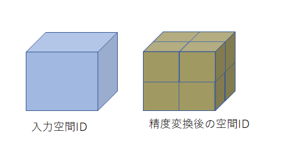
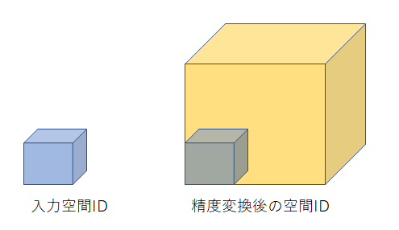

# 設計資料

本資料ではchange_zoom.goモジュール内で提供される下記、関数について記載をする。
- 拡張空間IDの精度変換関数
- 拡張空間IDの水平方向の精度変換関数
- 拡張空間IDの垂直方向の精度変換関数

## 拡張空間IDの精度変換関数

### 更新履歴
<table border=1>
<header>
<td width=13%>
版数
</td>
<td width=10%>
日付
</td>
<td>
概要
</td>
<td width=18%>
更新者
</td>
</header>
<tr>
<td>0.01</td>
<td>2022/12/20</td>
<td>新規作成</td>
<td>α藤間</td>
</tr>
<tr>
<td>0.02</td>
<td>2022/12/23</td>
<td>
<li>変換後のIDの重複削除について記載</li>
<li>空間ID用、拡張空間ID用の関数について記載</li>
</td>
<td>α藤間</td>
</tr>
</table>

### 処理概要
変換対象として入力された拡張空間IDを、指定された水平/垂直方向精度の拡張空間IDに変換する。
変換対象には複数の拡張空間IDを指定可能、精度が異なる拡張空間IDが混在している場合も入力を許容する。

精度を上げる場合、入力された拡張空間IDボクセルを変換後の精度で分割し、
入力された拡張空間IDに内包される拡張空間IDを返却する。
  

精度を下げる場合、入力された拡張空間IDボクセルを変換後の精度となるよう拡大し、
入力された拡張空間IDを内包している拡張空間IDを返却する。
  

水平/垂直方向精度について、一方の精度が上がり一方の精度が下がる場合、
精度が上がった方向はボクセルを分割、精度が下がった方向はボクセルの拡大がされた拡張空間IDを返却する。

拡張空間IDの返却時、IDの重複は解消された形で返却される。

「拡張空間IDの精度変換関数」とは別に、入力値・返却値のフォーマットを空間IDとする「空間IDの精度変換関数」も用意する。
空間ID、拡張空間IDのフォーマットは以下の通り。
<li>空間ID</li>
<ul><B>[精度]/[高さの位置]/[経度の位置]/[緯度の位置]</B></ul>
<li>拡張空間ID</li>
<ul><B>[水平精度]/[経度の位置]/[緯度の位置]/[垂直精度]/[高さの位置]</B></ul>

### 処理順序

1. 精度の入力チェック
ユーザが入力した精度の入力値チェックを実行する。
有効範囲外の精度が入力されていた場合はエラーとする。

1. 入力拡張空間IDリストを参照するループ処理開始
    <ol style="list-style-type: upper-roman">
    <li>
    水平方向成分の精度変換
        <ol style="list-style-type: lower-roman">
        <li>
        拡張空間IDの水平方向の精度変換を用いて、精度変換後の水平方向成分リストを取得 
        取得する垂直方向成分のフォーマットは以下。 
        <B>[水平精度]/[経度の位置]/[緯度の位置]</B>
        </li>
        </ol>
    </li>
    <li>
    垂直方向成分の精度変換
        <ol style="list-style-type: lower-roman">
        <li>
        拡張空間IDの垂直方向の精度変換を用いて、精度変換後の垂直方向成分リストを取得 
        取得する垂直方向成分のフォーマットは以下。 
        <B>[垂直精度]/[高さの位置]</B>
        </li>
        </ol>
    </li>
    <li>
    垂直方向成分リストを参照するループ処理開始 
        <ol style="list-style-type: lower-roman">
        <li>
        水平方向成分リストを参照するループ処理開始 
        <ol>
        <li>
        水平方向成分と垂直方向成分を結合して拡張空間IDを生成し、戻り値とするリストに格納 
        結合後の拡張空間IDのフォーマットは以下。 
        <B>[水平精度]/[経度の位置]/[緯度の位置]/[垂直精度]/[高さの位置]</B>
        </li>
        </ol>
        </li>
        </ol>
    </li>
    </ol>
1. 精度変換後の拡張空間IDを格納したリストを、IDの重複が解消された形で返却

## 拡張空間IDの水平方向の精度変換関数

### 更新履歴
<table border=1>
<header>
<td width=13%>
版数
</td>
<td width=10%>
日付
</td>
<td>
概要
</td>
<td width=18%>
更新者
</td>
</header>
<tr>
<td>0.01</td>
<td>2022/12/20</td>
<td>新規作成</td>
<td>α藤間</td>
</tr>
<tr>
<td>0.02</td>
<td>2022/12/23</td>
<td>
<li>ループで開始値の増加を行う位置を修正</li>
<li>文言の誤りを修正</li>
</td>
<td>α藤間</td>
</tr>
</table>

### 処理概要
変換対象として入力された拡張空間IDの水平方向成分を、指定された精度に変換する。
精度を上げる場合、入力された拡張空間IDボクセルを変換後の精度で分割し、
入力された拡張空間IDに内包される拡張空間IDを返却する。

精度を下げる場合、入力された拡張空間IDボクセルを変換後の精度となるよう拡大し、
入力された拡張空間IDを内包している拡張空間IDを返却する。

精度変換後の水平方向成分は以下のフォーマットで生成される。
<B>[精度]/[経度の位置]/[緯度の位置]</B>

### 処理順序
1. 変換前後の精度の差を取得
<B>精度の差：変換後の精度 - 変換前の精度</B>

1. 変換後の「経度の位置」「緯度の位置」の最小値・最大値を初期化
初期化時の数式は以下の通り。
<B>経度の位置最小値：変換対象の経度の位置</B>
<B>経度の位置最大値：変換対象の経度の位置</B>
<B>緯度の位置最小値：変換対象の緯度の位置</B>
<B>緯度の位置最大値：変換対象の緯度の位置</B>

1. 水平方向成分の分割数を計算
<B>水平方向成分の分割数：2^精度の差の絶対値</B>

1. 変換前後の精度の差により条件を分岐
分岐条件に応じて変換後の「経度の位置」「緯度の位置」の最小値・最大値を再設定する。
    <ol style="list-style-type: upper-roman">
        <li>
        精度の差が0を超えている場合 
        <B>経度の位置最小値：変換対象の経度の位置 × 水平方向成分の分割数</B> 
        <B>経度の位置最大値：経度の位置最小値 +  水平方向成分の分割数 - 1</B> 
        <B>緯度の位置最小値：変換対象の緯度の位置 × 水平方向成分の分割数</B> 
        <B>緯度の位置最大値：緯度の位置最小値 +  水平方向成分の分割数 - 1</B> 
        </li>
        <li>
        精度の差が0未満の場合 
        <B>経度の位置最小値：変換対象の経度の位置 ÷ 水平方向成分の分割数</B> 
        <B>経度の位置最大値：経度の位置最小値</B> 
        <B>緯度の位置最小値：変換対象の緯度の位置 ÷ 水平方向成分の分割数</B> 
        <B>緯度の位置最大値：緯度の位置最小値</B> 
        </li>
        <li>
        精度の差が0の場合 
        <B>経度の位置最小値：再設定は行わない</B> 
        <B>経度の位置最大値：再設定は行わない</B> 
        <B>緯度の位置最小値：再設定は行わない</B> 
        <B>緯度の位置最大値：再設定は行わない</B> 
        </li>
    </ol>

1. 緯度方向成分の精度変換のループ処理開始
開始値を「緯度の位置最小値」、終了値を「緯度の位置最大値」としてループ処理を開始する。
    <ol style="list-style-type: upper-roman">
        <li>
        経度方向成分の精度変換のループ処理開始 
        開始値を「経度の位置最小値」、終了値を「経度の位置最大値」としてループ処理を開始する。 
        <ol style="list-style-type: lower-roman">
            <li>
            精度変換後の水平方向成分リストを生成 
            以下のフォーマットで精度変換後の水平方向成分を生成し、戻り値に格納する。 
            <B>[変換後の精度]/[経度の位置]/[緯度の位置]</B>
            </li>
            <li>
            開始値(経度の位置)を1増加させる。 
            </li>
        </ol>
        </li>
        <li>
        開始値(緯度の位置)を1増加させる。 
        </li>
    </ol>

1. 精度変換後の水平方向成分を格納したリストを返却する。

## 拡張空間IDの垂直方向の精度変換関数

### 更新履歴
<table border=1>
<header>
<td width=13%>
版数
</td>
<td width=10%>
日付
</td>
<td>
概要
</td>
<td width=18%>
更新者
</td>
</header>
<tr>
<td>0.01</td>
<td>2022/12/20</td>
<td>新規作成</td>
<td>α藤間</td>
</tr>
<tr>
<td>0.02</td>
<td>2022/12/23</td>
<td>
<li>ループで開始値の増加を行う位置を修正</li>
<li>文言の誤りを修正</li>
</td>
<td>α藤間</td>
</tr>
</table>

### 処理概要
変換対象として入力された拡張空間IDの高さ方向成分を、指定された精度に変換する。
精度を上げる場合、入力された拡張空間IDボクセルを変換後の精度で分割し、
入力された拡張空間IDに内包される拡張空間IDを返却する。

精度を下げる場合、入力された拡張空間IDボクセルを変換後の精度となるよう拡大し、
入力された拡張空間IDを内包している拡張空間IDを返却する。

精度変換後の垂直方向成分は以下のフォーマットで生成される
<B>[精度]/[高さの位置]</B>

### 処理順序
1. 変換前後の精度の差を取得
<B>精度の差：変換後の精度 - 変換前の精度</B>

1. 変換後の「高さの位置」の最小値・最大値を初期化
初期化時の数式は以下の通り。
<B>高さの位置最小値：変換対象の高さの位置</B>
<B>高さの位置最大値：変換対象の高さの位置</B>

1. 垂直方向成分の分割数を計算
<B>垂直方向成分の分割数：2^精度の差の絶対値</B>

1. 変換前後の精度の差により条件を分岐
分岐条件に応じて変換後の「高さの位置」の最小値・最大値を再設定する。
    <ol style="list-style-type: upper-roman">
        <li>
        精度の差が0を超えている場合 
        <B>高さの位置最小値：変換対象の高さの位置 × 垂直方向成分の分割数</B> 
        <B>高さの位置最大値：高さの位置最小値 +  垂直方向成分の分割数 - 1</B> 
        </li>
        <li>
        精度の差が0未満の場合 
        <B>高さの位置最小値：変換対象の高さの位置 ÷ 垂直方向成分の分割数</B> 
        <B>高さの位置最大値：高さの位置最小値</B> 
        </li>
        <li>
        精度の差が0の場合 
        <B>高さの位置最小値：再設定は行わない</B> 
        <B>高さの位置最大値：再設定は行わない</B> 
        </li>
    </ol>

1. 高さ方向成分の精度変換のループ処理開始
開始値を「高さの位置最小値」、終了値を「高さの位置最大値」としてループ処理を開始する。
    <ol style="list-style-type: upper-roman">
        <li>
        精度変換後の垂直方向成分リストを生成 
        以下のフォーマットで精度変換後の垂直方向成分を生成し、戻り値に格納する。 
        <B>[変換後の精度]/[高さの位置]</B>
        </li>
        <li>
        開始値(高さの位置)を1増加させる 
        </li>
    </ol>

1. 精度変換後の垂直方向成分を格納したリストを返却する。

## 制約事項

### 更新履歴
<table border=1>
<header>
<td width=13%>
版数
</td>
<td width=10%>
日付
</td>
<td>
概要
</td>
<td width=18%>
更新者
</td>
</header>
<tr>
<td>0.01</td>
<td>2022/12/20</td>
<td>
新規作成 
</td>
<td>α藤間</td>
</tr>
</table>

<ul>
<li>
入力された全空間IDの精度変換結果はまとめて返却する。 
そのため、複数の空間IDを入力とした場合、精度変換前後の空間IDの対応を取ることはできない。
</li>
<li>
精度を上げる場合、水平精度1ごとに4のべき乗、垂直方向精度1ごとに2のべき乗で拡張空間ID数が増加する。 
低い精度から高い精度に変換する際、精度差が大きすぎると変換後の拡張空間ID数は大幅に増大するため、 
動作環境によってはメモリ不足となる可能性がある。
</li>
</ul>

## 使用ライブラリ

### 更新履歴
<table border=1>
<header>
<td width=13%>
版数
</td>
<td width=10%>
日付
</td>
<td>
概要
</td>
<td width=18%>
更新者
</td>
</header>
<tr>
<td>0.01</td>
<td>2022/12/20</td>
<td>新規作成</td>
<td>α藤間</td>
</tr>

</table>

- 外部ライブラリ利用無し