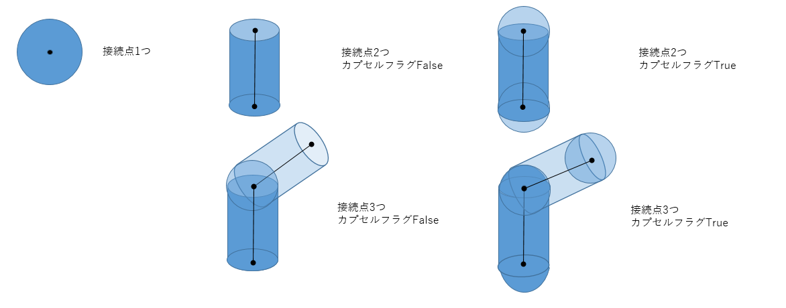
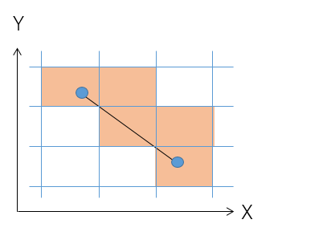
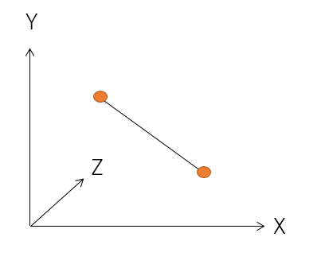
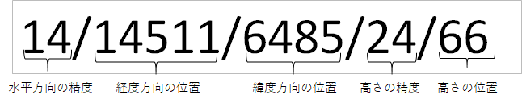
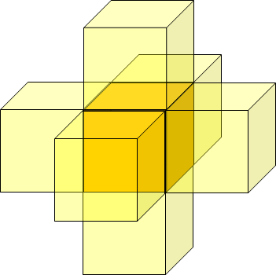
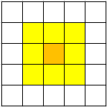
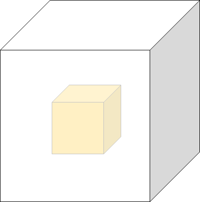

# 設計資料

本資料ではcylinders.goモジュール内で提供される下記APIについて記載をする。
- 指定範囲の拡張空間ID変換（円柱）
- 指定範囲の拡張空間ID変換（線分）
- 地理座標から投影座標への変換
- 投影座標から地理座標への変換
- 指定の数値分、移動した場合の拡張空間IDを取得
- 拡張空間IDの面に直接、接している6個の拡張空間IDの取得
- 拡張空間IDの水平方向の周囲、一周分の8個の拡張空間IDを取得
- 拡張空間IDを囲う26個の拡張空間IDを取得

## 指定範囲の拡張空間ID変換（円柱）

### 更新履歴
<table border=1>
<header>
<td width=13%>
版数
</td>
<td width=10%>
日付
</td>
<td>
概要
</td>
<td width=18%>
更新者
</td>
</header>
<tr>
<td>0.01</td>
<td>2022/11/2</td>
<td>新規作成</td>
<td>α藤間</td>
</tr>
<tr>
<td>0.02</td>
<td>2022/11/22</td>
<td>
"空間ID"の記載を"拡張空間ID"に置換
"空間ID"、"拡張空間ID"のフォーマットで結果を返却可能であることを処理概要に記載
</td>
<td>α藤間</td>
</tr>
<td>0.03</td>
<td>2023/02/20</td>
<td>
空間ID算出のロジックが変更になったため、記載を修正
</td>
<td>α加藤</td>
</tr>
</table>

### 処理概要
入力として、複数の円柱の接続点、半径、水平精度、垂直精度、カプセルフラグ、衝突判定実施フラグが与えられる。
衝突判定実施フラグは省略可能な値で、デフォルトは衝突判定実施を実施する値となっている。
接続点数が1のときは、球体が重なる拡張空間IDを返却する。球体は接続点を中心とし、半径で指定された球体を対象とする。
接続点数が0のときは、戻り値として空配列を返却する。
接続点数が2以上、かつカプセルフラグがFalseの場合は、円柱と球体が重なる拡張空間IDを返却する。円柱は円柱の接続点の連続する2つの点を中心線とし、半径の値で表現されたものを対象とする。球体は接続点を中心とし、半径で指定された球体を対象とする。
接続点数が2以上、かつカプセルフラグがTrueの場合は、円柱を両端を半球上としたカプセルとして扱う。カプセルは円柱の接続点の連続する2つの点を中心線とし、入力された半径で指定されたものを対象とする。
拡張空間ID変換でエラーが発生した場合は、エラーインスタンスを呼び出し元に投げる。
 

返却値のフォーマットを空間IDにする場合、生成された拡張空間IDを、空間IDのフォーマットに変換して返却する。
空間ID、拡張空間IDのフォーマットは以下の通り
<li>空間ID</li>
<ul><B>[精度]/[高さの位置]/[経度の位置]/[緯度の位置]</B></ul>
<li>拡張空間ID</li>
<ul><B>[精度]/[経度の位置]/[緯度の位置]/[精度]/[高さの位置]</B></ul>

### 処理順序
1. 入力チェック
半径が0以下の場合は、エラーとする。  
1. Webメルカトル係数補正の適用
入力の接続点の最初の値の緯度からWebメルカトル係数を算出する。
Webメルカトル係数補正は以下の値に補正値を掛ける処理となっている
  ・地理座標の拡張空間IDで使用する座標系(EPSG:3857)への座標変換後のZ座標
  ・入力の半径
以降の処理ではWebメルカトル係数補正を行なった状態で処理を行う。
 
1. 複数のオブジェクトが含まれる範囲の拡張空間IDの取得
入力された1つ１つのオブジェクトについて、それぞれ重なる拡張空間IDを取得する。
入力されたオブジェクトの中心の接続点配列をイテレータとして、最後の前のインデックスまでループ処理を開始する。ただし、同じ座標が連続している場合は、同じ座標を無視する。
    <ol style="list-style-type: upper-roman">
        <li>始点と終点の設定 
        地理座標から投影座標への変換を用いて始点、終点の地理座標を拡張空間IDで使用する座標系(EPSG:3857)に座標変換する。  </li>
        <li>始点、終点間のオブジェクトの軸の空間ID 
        始点、終点間をオブジェクトの軸として、軸の空間IDを算出する。 
        なお、オブジェクトが球の場合は、軸の空間IDとして始点、終点間の中点を用いる。  </li>
        <li>単位空間ボクセルの算出 
        拡張空間ID1つを単位空間ボクセルとする。 
        単位空間ボクセルとする空間IDは以下の成分を持つ空間IDとする。 
        <table border=1>
        <header>
        <td width=3%>
        拡張空間ID成分
        </td>
        <td width=10%>
        値
        </td>
        </header>
        <tr><td>経度</td><td>0</td></tr>
        <tr><td>緯度</td><td>2^水平精度-1</td></tr>
        <tr><td>水平精度</td><td>入力の水平精度</td></tr>
        <tr><td>高さ</td><td>0</td></tr>
        <tr><td>垂直精度</td><td>入力の垂直精度</td></tr>
        </table>
         </li>
        <li>オブジェクトを囲う全空間IDの算出 
        軸の空間IDからオブジェクトを囲う範囲にある空間IDを取得する。 
        入力の半径内に最大限格納可能な単位ボクセルの数をXYZ成分それぞれに求める。 
        XYZ成分それぞれに対して、軸の空間IDのインデックスを上記の個数のマイナスからプラスまで加えた空間IDをオブジェクトを囲う全空間IDとする。 
        なお、衝突判定実施フラグが衝突判定を行なわない値になっている場合は以降の処理を行なわず、全空間IDをオブジェクトの空間IDとして返却する。  </li>
        <li>オブジェクトに内接する内部空間IDの算出 
        軸の空間IDからオブジェクトに内接する範囲にある空間IDを取得する。 
        入力の半径/√2内に最小限格納可能な単位ボクセルの数をXYZ成分それぞれに求める。 
        XYZ成分それぞれに対して、軸の空間IDのインデックスを上記の個数のマイナスからプラスまで加えた空間IDをオブジェクトに内接する空間IDとする。 
        なお、オブジェクトが円柱の場合は以下で内部空間IDを取得する。
            <ol>
            <li>
            オブジェクトの軸の長さが半径の2倍より長い場合：内部空間IDの算出に用いる軸の始点、終点を始点、終点間の中点の向きへ半径分移動した点の間の軸を軸の空間IDとして、内部空間IDを取得する。
            </li>
            <li>
            オブジェクトの軸の長さが半径の2倍より短い場合：内部空間IDとする空間IDが元のオブジェクトの範囲外になるため、内部空間IDの算出を行なわない。
            </li>
            </ol>
         </li>
        <li>オブジェクトの空間ID取得 
        オブジェクトの全空間IDから内部空間IDを除いた空間IDを対象に、Azul3Dを用いて衝突判定を行う。内部空間IDに加えて衝突判定で衝突すると判定された空間IDをオブジェクトの空間IDとする。  
        </li>
    </ol>
1. 接続点の拡張空間IDの取得
円柱の場合、最初と最後を除いた接続点について、球の拡張空間IDを取得する。カプセルの場合は、取得しない。
球の拡張空間IDは、接続点を中心として、2.II.始点、終点間のオブジェクトを内包する直方体の設定～2.XV.円柱の拡張空間ID取得の処理を行うことで取得する。
接続点が1つの場合も、球の拡張空間IDを取得する。  
1. 返却値の設定
全ての円柱、球の拡張空間IDを重複がない状態で返却する。  

### 制限事項
- 円柱を構成する中心線の端点は西側から東側に繋いだ線分として解釈する
- 経度180度をまたがるオブジェクトについては未対応
- 接続点に設定される地理座標はWGS84(EPSG:4326)であることを前提とする。

## 指定範囲の拡張空間ID変換（線分）

### 更新履歴
<table border=1>
<header>
<td width=13%>
版数
</td>
<td width=10%>
日付
</td>
<td>
概要
</td>
<td width=18%>
更新者
</td>
</header>
<tr>
<td>0.01</td>
<td>2022/11/2</td>
<td>新規作成</td>
<td>α藤間</td>
</tr>
<tr>
<td>0.02</td>
<td>2022/11/22</td>
<td>
"空間ID"の記載を"拡張空間ID"に置換
"中点取得の再帰処理"における緯度経度の閾値設定について情報を追記
</td>
<td>α藤間</td>
</tr>
</table>

### 処理概要
入力として、始点、終点、水平精度、垂直精度が与えられる。
始点と終点間の線分が重なる拡張空間IDを取得する。
頂点を通過した場合は、それぞれプラス方向の空間ボクセルに含まれるものとする。
 
### 処理順序
1. 始点、終点の拡張空間ID取得
地理座標から拡張空間IDへの変換(点群)を用いて入力された始点、終点から拡張空間IDを取得する。
  
1. 始点、終点間の中点の座標取得
始点・終点を結んだ線分の中点の地理座標を取得する。  
1. 中点の拡張空間IDを取得
地理座標から拡張空間IDへの変換(点群)を用いて、取得した中点の座標から拡張空間IDを取得する。  
1. 中点取得の再帰処理
線分A(始点・中点)、線分Bを(中点・終点)を対象として、2～3の処理を再帰的に実行する。
以下の条件を満たした場合、再帰処理を終了する。
    - 分割された線分の端点2つの拡張空間IDが同じ、または隣接する（前後左右上下の6方向の）ボクセルであった場合。
    - 分割された線分の長さがマンハッタン距離で1cm未満となった場合。  

    地理座標である端点間の距離をcmで取得するには座標系変換を伴う計算を行う必要があるが、
    上記の計算処理は時間がかかるため、再帰処理内で行う処理として望ましくない。 
    そのため、直交座標へ変換した際の値が1cm未満となる座標成分を閾値として用意し、
    線分の端点A・Bの差分(距離)が閾値を超えていないかを判定する。 
    各成分の閾値を以下とすることで、直交座標変換時の各成分の距離が0.33...(cm)以下となり、
    端点間のマンハッタン距離は1cm未満となる。
     - 緯度：0.00000002°
     - 経度：0.00000002°
     - 高さ：0.3cm
     

    「緯度」「経度」「高さ」の内、一成分でも上記の閾値を超える場合は再帰処理を継続する。
    全ての成分が閾値を下回った場合、再帰処理を終了する。
    端点の緯度・経度が等しく高さのみ異なるケース等、値が等しい成分が存在する場合は、距離が1cm未満であっても再帰処理が継続される。
    この場合も、全ての成分が閾値を下回った時点で再帰処理を終了する。
     

    緯度経度を距離に変換した場合の値については、以下のサイトを参考にしている。
    URL： https://www.wingfield.gr.jp/archives/9721
     

    上記サイトによると、緯度経度1°あたりの実距離は測定地点の緯度の値によっては異なってる。
    そのため、緯度経度を距離に変換した際、1°あたりの距離が最小となる測定地点を基準に閾値を設定している。

    測定値地点ごとに、距離を角度に変換した確認結果は以下の通り。
    <table border=1>
    <header>
    <td width=13%>
    成分
    </td>
    <td width=10%>
    距離最小となる緯度
    </td>
    <td>
    1mあたりの度数
    </td>
    <td>
    3mmあたりの度数
    </td>
    </header>
    <tr>
    <td>経度</td>
    <td>0°付近</td>
    <td>0.0000089832°</td>
    <td>0.0000000269496°</td>
    </tr>
    <tr>
    <td>緯度</td>
    <td>89°付近</td>
    <td>0.0000089531°</td>
    <td>0.0000000268593°</td>
    </tr>
    </table>
    3mmあたりの厳密な緯度経度としては上記のようになるが、1cmを確実に超えない値となるよう端数を削った0.00000002°を閾値として設定している。
     
     

    また、水平精度、垂直精度が高い場合ボクセル1辺の長さが上記の閾値以下となってしまい、
    水平方向、垂直方向、それぞれに対して平行に伸ばした線分においても端点間の拡張空間IDを全て取得する前に再起処理が終了してしまう可能性がある。
    水平精度、垂直精度が以下の値の場合がこのケースに該当する。
     - 水平精度：31以上
     - 垂直精度：34以上
     

    入力された水平精度、垂直精度が上記の精度以上だった場合は、
    水平精度、垂直精度に最大値(35)を設定した場合のボクセル1辺の長さを閾値とすることで、
    上記のパターンでも端点間の拡張空間IDを取得できる。

    閾値を1辺の長さと同じ値にした場合、線分によっては上記の問題が再現することも考えられるため、
    精度の最大値における1辺の長さの約半分となる値を高精度用の閾値として設定する。
    <ol style="list-style-type: circle">
    <li>水平精度31以上
        <ol>
        経度：0.000000005° 
        緯度：0.0000000005° 
        </ol>
    </li>
    <li>垂直精度34以上
        <ol>
        高さ：0.05cm 
        </ol>
    </li>
    </ol>
     

1. 返却値の設定
取得した拡張空間IDを重複がない状態で返却する。  

### 制限事項
- 線分は端点を西側から東側に繋いだ線分として解釈する。
- 始点、終点に設定される地理座標はWGS84(EPSG:4326)であることを前提とする。

## 投影座標から地理座標への変換

### 更新履歴
<table border=1>
<header>
<td width=13%>
版数
</td>
<td width=10%>
日付
</td>
<td>
概要
</td>
<td width=18%>
更新者
</td>
</header>
<tr>
<td>0.01</td>
<td>2022/11/2</td>
<td>新規作成</td>
<td>α藤間</td>
</tr>
<tr>
<td>0.02</td>
<td>2022/11/22</td>
<td>
座標変換に使用するライブラリが"go-proj"から"wgs84"に変更となったため処理順序に反映
</td>
<td>α藤間</td>
</tr>
</table>

### 処理概要
投影座標が格納されたデータクラスオブジェクトとその投影座標のEPSGコードを引数に地理座標のリストを返却する。
入力された投影座標のオブジェクトのリストをWGS84の地理座標のオブジェクトのリストに変換する。

### 処理順序
1. 変換の前処理実行
wgs84のCRSオブジェクトを作成する。
入力されたEPSGコード及び、WGS84のCRSオブジェクトを作成する。

1. 変換の実行
入力されたオブジェクトのリストをイテレータとして取り出した座標を一つずつ変換する。
入力されたEPSGコードが存在しなかった場合、エラーとなる。

1. 変換結果を変換用リストオブジェクトに格納し返却する。

## 地理座標から投影座標への変換

### 更新履歴
<table border=1>
<header>
<td width=13%>
版数
</td>
<td width=10%>
日付
</td>
<td>
概要
</td>
<td width=18%>
更新者
</td>
</header>
<tr>
<td>0.01</td>
<td>2022/11/2</td>
<td>新規作成</td>
<td>α藤間</td>
</tr>
<tr>
<td>0.02</td>
<td>2022/11/22</td>
<td>
座標変換に使用するライブラリが"go-proj"から"wgs84"に変更となったため処理順序に反映
</td>
<td>α藤間</td>
</tr>
</table>

### 処理概要
地理座標が格納されたデータクラスオブジェクト、変換元の地理座標のEPSGコード、変換先の投影座標のEPSGコードを引数に投影座標のオブジェクトのリストを返却する。

### 処理順序
1. 変換の前処理実行
wgs84のCRSオブジェクトを作成する。
入力されたEPSGコード及び、WGS84のCRSオブジェクトを作成する。

1. 変換の実行
入力されたオブジェクトのリストをイテレータとして取り出した座標を一つずつ変換する。
入力されたEPSGコードが存在しなかった場合、エラーとなる。

1. 変換結果を変換用リストオブジェクトに格納し返却する。

## 指定の数値分、移動した場合の拡張空間IDを取得

### 更新履歴
<table border=1>
<header>
<td width=13%>
版数
</td>
<td width=10%>
日付
</td>
<td>
概要
</td>
<td width=18%>
更新者
</td>
</header>
<tr>
<td>0.01</td>
<td>2022/11/2</td>
<td>新規作成</td>
<td>α藤間</td>
</tr>
<tr>
<td>0.02</td>
<td>2022/11/22</td>
<td>
"空間ID"の記載を"拡張空間ID"に置換
</td>
<td>α藤間</td>
</tr>
<tr>
<td>0.03</td>
<td>2022/12/5</td>
<td>
移動先の位置が「移動先の位置 % 2^精度」となる条件に、移動先の位置が0未満の場合を追加。
</td>
<td>α藤間</td>
</tr>
</table>

### 処理概要
緯度、経度、高さ方向の移動距離を指定する。入力された拡張空間IDがその距離分移動した先の拡張空間IDを取得する。

### 処理順序

1. 拡張空間IDの分解
入力された拡張空間IDから経度の位置、緯度の位置、高さの位置を取得する。

1. 各方向の移動先の位置の取得
    <B>
    経度方向の移動先: 経度の位置 + 入力された移動距離 
    緯度方向の移動先: 緯度の位置 + 入力された移動距離 
    高さ方向の移動先: 高さの位置 + 入力された移動距離 
    </B>

1. 移動先の位置が(2^精度-1)を超えている場合、または移動先の位置が0未満の場合、「移動先の位置 % 2^精度」の値を移動先とする。

1. 拡張空間IDの生成
移動先の位置を拡張空間IDとして返却する。
※精度は同じ。

## 拡張空間IDの面に直接、接している6個の拡張空間IDの取得

### 更新履歴
<table border=1>
<header>
<td width=13%>
版数
</td>
<td width=10%>
日付
</td>
<td>
概要
</td>
<td width=18%>
更新者
</td>
</header>
<tr>
<td>0.01</td>
<td>2022/11/2</td>
<td>新規作成</td>
<td>α藤間</td>
</tr>
<tr>
<td>0.02</td>
<td>2022/11/22</td>
<td>
"空間ID"の記載を"拡張空間ID"に置換
</td>
<td>α藤間</td>
</tr>
</table>

### 処理概要
入力された拡張空間IDを中心に、上下、左右、手前奥の計6個の拡張空間IDを取得する。

### 処理順序
1. 拡張空間IDの分解
入力された拡張空間IDから経度の位置、緯度の位置、高さの位置を取得する。
取得は下記のようなイメージになる。

1. 下記の6個の拡張空間IDを取得
    <B>
    経度方向に +1 した拡張空間ID 
    経度方向に -1 した拡張空間ID 
    緯度方向に +1 した拡張空間ID 
    緯度方向に -1 した拡張空間ID 
    高さ方向に +1 した拡張空間ID 
    高さ方向に -1 した拡張空間ID 
    </B>

1. 拡張空間IDの生成
移動先の位置を拡張空間IDとして返却用リストに格納し返却する。
※精度は同じ。

### 制限事項
- 特定の拡張空間IDの周囲の拡張空間IDを取得する場合、取得先の拡張空間IDのインデックスが精度の範囲の限界を超えることがある。その場合、「指定の数値分、移動した場合の拡張空間IDを取得」の関数と同様に拡張空間IDを扱う。

## 拡張空間IDの水平方向の周囲、一周分の8個の拡張空間IDを取得

### 更新履歴
<table border=1>
<header>
<td width=13%>
版数
</td>
<td width=10%>
日付
</td>
<td>
概要
</td>
<td width=18%>
更新者
</td>
</header>
<tr>
<td>0.01</td>
<td>2022/11/2</td>
<td>新規作成</td>
<td>α藤間</td>
</tr>
<tr>
<td>0.02</td>
<td>2022/11/22</td>
<td>
"空間ID"の記載を"拡張空間ID"に置換
</td>
<td>α藤間</td>
</tr>
</table>

### 処理概要
入力された拡張空間IDを中心に、左右、手前奥、水平面の対角線上の先の計8個の拡張空間IDを取得する。
取得は下記のようなイメージになる。

### 処理順序
1. 拡張空間IDの分解
入力された拡張空間IDから経度の位置、緯度の位置、高さの位置を取得する。

1. 下記の8個の拡張空間IDを取得
    <B>
    経度方向に +1 した拡張空間ID 
    経度方向に -1 した拡張空間ID 
    緯度方向に +1 した拡張空間ID 
    緯度方向に -1 した拡張空間ID 
    経度方向に +1、緯度方向に -1 した拡張空間ID 
    経度方向に -1、緯度方向に -1 した拡張空間ID 
    経度方向に +1、緯度方向に +1 した拡張空間ID 
    経度方向に -1、緯度方向に +1 した拡張空間ID 
    </B>

1. 拡張空間IDの返却
取得した8個の拡張空間IDを返却用リストに格納して返却する。

### 制限事項
- 特定の拡張空間IDの周囲の拡張空間IDを取得する場合、取得先の拡張空間IDのインデックスが精度の範囲の限界を超えることがある。その場合、「指定の数値分、移動した場合の拡張空間IDを取得」の関数と同様に拡張空間IDを扱う。

## 拡張空間IDを囲う26個の拡張空間IDを取得

### 更新履歴
<table border=1>
<header>
<td width=13%>
版数
</td>
<td width=10%>
日付
</td>
<td>
概要
</td>
<td width=18%>
更新者
</td>
</header>
<tr>
<td>0.01</td>
<td>2022/11/2</td>
<td>新規作成</td>
<td>α藤間</td>
</tr>
<tr>
<td>0.02</td>
<td>2022/11/22</td>
<td>
"空間ID"の記載を"拡張空間ID"に置換
</td>
<td>α藤間</td>
</tr>
</table>

### 処理概要
入力された拡張空間IDを中心として、面、辺、頂点のいずれかが接する計26個の拡張空間IDを取得する。
下記のように拡張空間IDを中心としてその周囲の拡張空間IDを取得するイメージになる。

### 処理順序
1. 拡張空間IDの分解
拡張空間IDから経度の位置、緯度の位置、高さの位置を取得

1. 下記の26個の拡張空間IDを取得
    <B>
    高さ方向に +1 した拡張空間ID 
    経度方向に +1、高さ方向に +1 した拡張空間ID 
    経度方向に -1、高さ方向に +1 した拡張空間ID 
    緯度方向に +1、高さ方向に +1 した拡張空間ID 
    緯度方向に -1、高さ方向に +1 した拡張空間ID 
    経度方向に +1、緯度方向に -1、高さ方向に +1 した拡張空間ID 
    経度方向に -1、緯度方向に -1、高さ方向に +1 した拡張空間ID 
    経度方向に +1、緯度方向に +1、高さ方向に +1 した拡張空間ID 
    経度方向に -1、緯度方向に +1、高さ方向に +1 した拡張空間ID 
     
    経度方向に +1 した拡張空間ID 
    経度方向に -1 した拡張空間ID 
    緯度方向に +1 した拡張空間ID 
    緯度方向に -1 した拡張空間ID 
    経度方向に +1、緯度方向に -1 した拡張空間ID 
    経度方向に -1、緯度方向に -1 した拡張空間ID 
    経度方向に +1、緯度方向に +1 した拡張空間ID 
    経度方向に -1、緯度方向に +1 した拡張空間ID 
     
    高さ方向に -1 した拡張空間ID 
    経度方向に +1、高さ方向に -1 した拡張空間ID 
    経度方向に -1、高さ方向に -1 した拡張空間ID 
    緯度方向に +1、高さ方向に -1 した拡張空間ID 
    緯度方向に -1、高さ方向に -1 した拡張空間ID 
    経度方向に +1、緯度方向に -1、高さ方向に -1 した拡張空間ID 
    経度方向に -1、緯度方向に -1、高さ方向に -1 した拡張空間ID 
    経度方向に +1、緯度方向に +1、高さ方向に -1 した拡張空間ID 
    経度方向に -1、緯度方向に +1、高さ方向に -1 した拡張空間ID 
    </B>

1. 拡張空間IDの返却
取得した26個の拡張空間IDを返却用リストに格納して返却する。

### 制限事項
- 特定の拡張空間IDの周囲の拡張空間IDを取得する場合、取得先の拡張空間IDのインデックスが精度の範囲の限界を超えることがある。その場合、「指定の数値分、移動した場合の拡張空間IDを取得」の関数と同様に拡張空間IDを扱う。

## 使用ライブラリ

### 更新履歴
<table border=1>
<header>
<td width=13%>
版数
</td>
<td width=10%>
日付
</td>
<td>
概要
</td>
<td width=18%>
更新者
</td>
</header>
<tr>
<td>0.01</td>
<td>2022/11/2</td>
<td>新規作成</td>
<td>α藤間</td>
</tr>
<tr>
<td>0.02</td>
<td>2022/11/22</td>
<td>
使用ライブラリから"go-proj"を削除
使用ライブラリに"wgs84"を追加
</td>
<td>α藤間</td>
</tr>
</table>

- Azul3D
    - バージョン:0.0.0-20211024043305
    - goバージョン:&gt;=1.18.7
    - 確認日:2022/10/24
    - 用途:円柱と空間ボクセルの衝突確認に使用する
- wgs84
    - バージョン:1.1.6
    - goバージョン:&gt;=1.18.7
    - 確認日:2022/11/22
    - 座標変換に使用する