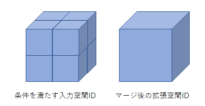
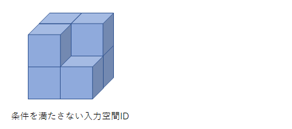

# 設計資料

本資料ではmerge_zoom.goモジュール内で提供される下記関数について記載をする。
- 拡張空間IDの最適化関数
- 単位分割拡張空間ID取得関数
- 最適化後拡張空間ID取得関数

## 拡張空間IDを最適化関数

### 更新履歴
<table border=1>
<header>
<td width=13%>
版数
</td>
<td width=10%>
日付
</td>
<td>
概要
</td>
<td width=18%>
更新者
</td>
</header>
<tr>
<td>0.01</td>
<td>2023/1/6</td>
<td>新規作成</td>
<td>α藤間</td>
</tr>
</table>

### 処理概要
入力として、複数の拡張空間ID、最適化後の水平方向精度、最適化後の垂直方向精度が与えられる。

入力された拡張空間IDリストをより大きな拡張空間IDに最適化し、最適化した結果を返却する。
最適化後の拡張空間IDの精度は、引数で指定された水平方向精度、垂直方向精度となる。

入力された拡張空間IDリストの内、以下の条件をどちらも満たす拡張空間IDが最適化対象となる。
条件を満たさない拡張空間IDは最適化対象外となり、そのまま返却する。
<ul>
<li>
拡張空間IDの水平方向精度が、最適化後の水平方向精度以上
</li>
<li>
拡張空間IDの垂直方向精度が、最適化後の垂直方向精度以上
</li>
</ul>

入力された拡張空間IDリストが最適化される条件は以下となる。
<ul>
<li>
最適化後の精度の拡張空間ID範囲を完全に満たす拡張空間ID群が、入力された拡張空間ID群に含まれていた場合 
範囲内に含まれる拡張空間IDリストを、最適化後の精度の拡張空間IDに最適化する。
</li>
    <ol style="list-style-type: circle">
        <li>条件を満たすパターン</li>
          
        <li>条件を満たさないパターン</li>
          
    </ol>
</ul>

最適化後に重複する拡張空間IDが存在した場合は、重複を除去したうえで返却する。
最適化条件に合致しなかった拡張空間ID、最適化対象外の拡張空間IDはそのまま返却される。

「拡張空間IDの最適化関数」とは別に、入力値・返却値のフォーマットを空間IDとする「空間IDの最適化関数」も用意する。
空間ID、拡張空間IDのフォーマットは以下の通り。
<li>空間ID</li>
<ul><B>[精度]/[高さの位置]/[経度の位置]/[緯度の位置]</B></ul>
<li>拡張空間ID</li>
<ul><B>[水平精度]/[経度の位置]/[緯度の位置]/[垂直精度]/[高さの位置]</B></ul>

### 処理順序
1. 精度の入力チェック
ユーザが入力した精度の入力値チェックを実行する。
有効範囲外の精度が入力されていた場合はエラーとする。

1. 最適化対象の拡張空間IDを取得
    入力拡張空間IDリストの各要素に対して以下のチェックを行い、最適化対象とする拡張空間IDであるか否かを判定する。
    また、入力拡張空間IDリストのうち最大の水平方向精度、垂直方向精度も合わせて取得する。
    <ol style="list-style-type: upper-roman">
    <li>
    拡張空間IDの水平/垂直方向精度の両方が、最適化後の精度以上の場合 
    拡張空間IDを、最適化対象拡張空間IDリストに格納する。
    </li>
    <li>
    拡張空間IDの水平/垂直方向精度のいずれかが、最適化後の精度未満の場合 
    拡張空間IDを、最適化後拡張空間IDリストに格納する。
    </li>
    </ol>

1. 単位分割した拡張空間IDを取得
    最適化対象拡張空間IDリストの要素ごとに単位分割拡張空間ID取得関数を呼び出し、
    最大水平方向精度、最大垂直方向精度の単位に分割した「単位分割拡張空間ID情報」を取得する。
    取得した単位分割拡張空間ID情報は単位分割拡張空間ID情報リストに格納する。
    単位分割拡張空間ID取得関数を呼び出し時の入力値は以下とする。
    <ol style="list-style-type: disc">
    <li>最適化対象拡張空間ID</li>
    <li>最大水平方向精度 - 最適化対象拡張空間IDの水平方向精度</li>
    <li>最大垂直方向精度 - 最適化対象拡張空間IDの垂直方向精度</li>
    </ol>

1. 単位分割拡張空間IDから最適化後の拡張空間IDを取得
    単位分割拡張空間ID情報リストの要素ごとに最適化後拡張空間ID取得関数を呼び出し、
    引数指定の水平方向精度、垂直方向精度に最適化した「最適化後拡張空間ID情報」を取得する。
    取得した最適化後拡張空間ID情報は、最適化後拡張空間ID辞書に格納する。
    最適化後拡張空間ID辞書のキー値は、最適化後拡張空間ID情報の要素「最適化後の拡張空間ID」とする。
    <ol style="list-style-type: upper-roman">
    <li>
    取得した最適化後拡張空間ID情報が辞書に登録済みの場合 
    登録済みの最適化後拡張空間ID情報の要素に、取得した最適化後拡張空間ID情報の要素をマージする。 
    マージの対象となるのは最適化後拡張空間ID情報の以下の要素。 
        <ol style="list-style-type: disc">
        <li>最適化元拡張空間ID配列</li>
        <li>単位分割拡張空間ID集合</li>
        </ol>
    </li>
    <li>
    最適化後拡張空間ID情報が辞書に未登録の場合 
    取得した最適化後拡張空間ID情報を、辞書に登録する。
    </li>
    </ol>

1. 拡張空間IDの最適化条件を満たすかを判定
    入力拡張空間IDリストを元に作成した最適化後拡張空間ID辞書の要素ごとに、以下のマージ条件を満たすかを判定する。
    <ol style="list-style-type: upper-roman">
    <li>
    単位分割拡張空間ID集合の要素数が、単位拡張空間IDの個数の閾値に等しい場合 
    最適化条件が満たされたと判定し、最適化後拡張空間ID情報の要素「拡張空間ID」を、最適化後拡張空間IDリストに格納する。
    </li>
    <li>
    単位分割拡張空間ID集合の要素数が、単位拡張空間IDの個数の閾値にと異なる場合 
    最適化条件を満たさないと判定し、最適化後拡張空間ID情報の要素「最適化元拡張空間ID配列」を、最適化後拡張空間IDリストに結合
    </li>
    </ol>

1. 最適化後拡張空間IDリストを、IDの重複が解消された形で返却

## 単位分割拡張空間ID取得関数

### 更新履歴
<table border=1>
<header>
<td width=13%>
版数
</td>
<td width=10%>
日付
</td>
<td>
概要
</td>
<td width=18%>
更新者
</td>
</header>
<tr>
<td>0.01</td>
<td>2023/1/6</td>
<td>新規作成</td>
<td>α藤間</td>
</tr>
</table>

### 処理概要
入力として、拡張空間ID、分割前後の水平方向精度差分、分割前後の垂直方向精度差分が与えられる。

入力された拡張空間ID及び、分割前後の精度差分を元に、
分割後の精度となる拡張空間IDの情報を持つ構造体(以降、単位分割拡張空間ID情報と呼称)生成して返却する。

構造体の持つ要素は以下。
<ol style="list-style-type: disc">
<li>分割前の拡張空間ID</li>
<li>分割前後の水平方向精度差分</li>
<li>分割前後の垂直方向精度差分</li>
<li>分割後の拡張空間ID集合</li>
</ol>

### 処理順序

1. 分割後の拡張空間IDの個数を取得
<B>水平方向の拡張空間ID個数：2^分割前後の水平方向精度差分</B>
<B>垂直方向の拡張空間ID個数：2^分割前後の垂直方向精度差分</B>

1. 拡張空間IDの分割を実施
水平方向の拡張空間ID個数、垂直方向の拡張空間ID個数を元に経度ID、緯度ID、高さIDを取得し、
分割後の拡張空間IDを生成するループ処理を行う。
生成した分割後の拡張空間IDは、分割後の拡張空間ID集合に追加する。
ループ処理の開始値、終了値については以下の式で定義する。
<B>経度ID分割開始ID：分割前経度ID * 水平方向の拡張空間ID個数</B>
<B>経度ID分割終了ID：(分割前経度ID + 1) * 水平方向の拡張空間ID個数</B>
<B>緯度ID分割開始ID：分割前緯度ID * 水平方向の拡張空間ID個数</B>
<B>緯度ID分割終了ID：(分割前緯度ID + 1) * 水平方向の拡張空間ID個数</B>
<B>高さID分割開始ID：分割前高さID * 垂直方向の拡張空間ID個数</B>
<B>高さID分割終了ID：(分割前高さID + 1) * 垂直方向の拡張空間ID個数</B>
    <ol style="list-style-type: upper-roman">
    <li>
    経度IDの分割ループを実施 
        <ol style="list-style-type: lower-roman">
        <li>
        緯度IDの分割ループを実施 
            <ol style="list-style-type: lower-alpha">
            <li>
            高さIDの分割ループを実施 
            以下のフォーマットで精度変換後の拡張空間IDを生成する。 
            <B>[水平精度]/[経度の位置]/[緯度の位置]/[垂直精度]/[高さの位置]</B>
            </li>
            <li>
            精度変換後の拡張空間IDを、分割後の拡張空間ID集合に追加 
            </li>
            <li>
            開始値(高さの位置)を1増加させる。 
            </li>
            </ol>
        <li>
        開始値(緯度の位置)を1増加させる。 
        </li>
        </ol>
    <li>
    開始値(経度の位置)を1増加させる。 
    </li>
    </ol>

1. 単位分割拡張空間ID情報を生成し、返却する。

## 最適化後拡張空間ID取得関数

### 更新履歴
<table border=1>
<header>
<td width=13%>
版数
</td>
<td width=10%>
日付
</td>
<td>
概要
</td>
<td width=18%>
更新者
</td>
</header>
<tr>
<td>0.01</td>
<td>2023/1/6</td>
<td>新規作成</td>
<td>α藤間</td>
</tr>
</table>

### 処理概要
入力として、単位分割拡張空間ID情報、最適化前後の水平方向精度、最適化前後の垂直方向精度が与えられる。

入力された単位分割拡張空間ID情報及び、最適化前後の精度差分を元に、
拡張空間IDの最適化候補である精度が粗い拡張空間IDの情報を持つ構造体(以降、最適化後拡張空間ID情報と呼称)を生成して返却する。

構造体の持つ要素は以下。
<ol style="list-style-type: disc">
<li>最適化後の拡張空間ID</li>
<li>単位拡張空間IDの個数の閾値</li>
<li>最適化元拡張空間ID配列</li>
<li>単位分割拡張空間ID集合</li>
</ol>

### 処理順序
1. 最適化後の拡張空間IDの要素取得
    入力された単位分割拡張空間ID情報の要素「分割前の拡張空間ID」の要素を元に、最適化後の拡張空間IDの要素を取得する。
    最適化後の拡張空間IDの要素を求める際に使用する、最適化前の水平/垂直方向精度、経度ID、緯度ID、高さIDについては、分割前の拡張空間IDの要素から取得する。
    <ol style="list-style-type: upper-roman">
    <li>
    最適化後の拡張空間IDの精度を取得 
    <B>最適化後水平方向精度：最適化前水平方向精度 - 最適化前後の水平方向精度差分</B> 
    <B>最適化後垂直方向精度：最適化前垂直方向精度 - 最適化前後の垂直方向精度差分</B> 
    </li>
    <li>
    最適化後の拡張空間IDにおける経度ID、緯度ID、高さIDを取得 
    <B>経度ID：最適化前経度ID / (2^最適化前後の水平方向精度差分)</B> 
    <B>緯度ID：最適化前緯度ID / (2^最適化前後の水平方向精度差分)</B> 
    <B>高さID：最適化前高さID / (2^最適化前後の垂直方向精度差分)</B> 
    </li>
    </ol>

1. 単位拡張空間IDの個数の閾値を取得
<B>水平方向の閾値：2^(最適化前後の水平方向精度差分 + 単位分割拡張空間IDの分割前後の水平方向精度差分)</B>
<B>垂直方向の閾値：2^(最適化前後の垂直方向精度差分 + 単位分割拡張空間IDの分割前後の垂直方向精度差分)</B>
<B>単位拡張空間IDの個数の閾値：水平方向の閾値 * 水平方向の閾値 * 垂直方向の閾値</B>

1. 最適化元拡張空間ID配列を取得
入力された単位分割拡張空間ID情報の要素「分割前の拡張空間ID」を取得し、最適化元拡張空間ID配列に追加する。
<B>最適化元拡張空間ID配列：単位分割拡張空間IDの分割前の拡張空間ID</B>

1. 単位分割拡張空間ID集合を取得
<B>単位分割拡張空間ID集合：単位分割拡張空間IDの分割後の拡張空間ID集合</B>

1. 最適化後拡張空間ID情報を生成し、返却する。

## 制約事項

### 更新履歴
<table border=1>
<header>
<td width=13%>
版数
</td>
<td width=10%>
日付
</td>
<td>
概要
</td>
<td width=18%>
更新者
</td>
</header>
<tr>
<td>0.01</td>
<td>2023/1/6</td>
<td>
新規作成 
</td>
<td>α藤間</td>
</tr>
</table>

<ul>
<li>
精度を上げる場合、水平精度1ごとに4のべき乗、垂直方向精度1ごとに2のべき乗で拡張空間ID数が増加する。 
以下のような場合に分割後の拡張空間ID数は大幅に増大するため、動作環境によってはメモリ不足となる可能性がある。 
    <ol style="list-style-type: circle">
    <li>
    入力の拡張空間ID配列全体での精度の幅が大きい場合。
    </li>
    <li>
    入力の拡張空間ID内の水平精度と垂直精度に大きい差分がある場合。
    </li>
    <li>
    拡張空間IDが大量に入力された場合。
    </li>
</li>
</ul>

## 使用ライブラリ

### 更新履歴
<table border=1>
<header>
<td width=13%>
版数
</td>
<td width=10%>
日付
</td>
<td>
概要
</td>
<td width=18%>
更新者
</td>
</header>
<tr>
<td>0.01</td>
<td>2023/1/6</td>
<td>新規作成</td>
<td>α藤間</td>
</tr>

</table>

- 外部ライブラリ利用無し