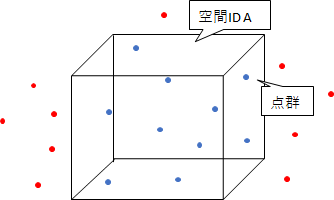
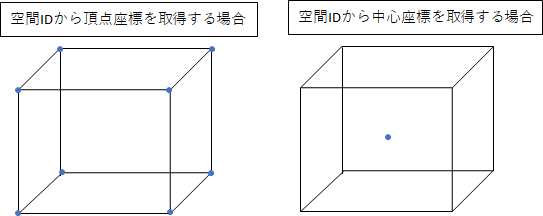
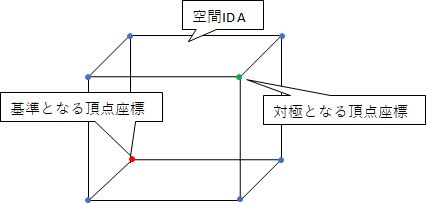

# 設計資料

本資料ではpoint.goモジュール内で提供される下記、関数について記載をする。
- 地理座標から拡張空間IDへの変換(点群)
- 拡張空間IDから地理座標への変換
- 精度の入力制限の確認

## 地理座標から拡張空間IDへの変換(点群)

### 更新履歴
<table border=1>
<header>
<td width=13%>
版数
</td>
<td width=10%>
日付
</td>
<td>
概要
</td>
<td width=18%>
更新者
</td>
</header>
<tr>
<td>0.01</td>
<td>2022/10/26</td>
<td>新規作成</td>
<td>α藤間</td>
</tr>
<tr>
<td>0.02</td>
<td>2022/11/22</td>
<td>
"空間ID"の記載を"拡張空間ID"に置換
"空間ID"、"拡張空間ID"のフォーマットで結果を返却可能であることを処理概要に記載
</td>
<td>α藤間</td>
</tr>
</table>

### 処理概要
地理座標が格納されたデータクラスオブジェクトを引数に拡張空間IDを返却する。

図のような点群データが与えられた場合、拡張空間ID Aで囲まれた範囲の地理座標はすべて同じ拡張空間IDとなる。

返却値のフォーマットを空間IDにする場合、生成された拡張空間IDを、空間IDのフォーマットに変換して返却する。
空間ID、拡張空間IDのフォーマットは以下の通り
<li>空間ID</li>
<ul><B>[精度]/[高さの位置]/[経度の位置]/[緯度の位置]</B></ul>
<li>拡張空間ID</li>
<ul><B>[精度]/[経度の位置]/[緯度の位置]/[精度]/[高さの位置]</B></ul>

### 処理順序

1. 精度の入力チェック
ユーザが入力した精度の入力値チェックを実行する。
有効範囲外の精度が入力されていた場合はエラーとする。

1. 入力地理座標リストループ処理の開始
入力された地理座標のオブジェクトのリストをイテレータとしてループ処理を開始する。
    <ol style="list-style-type: upper-roman">
        <li>
        水平方向のタイルIDの作成
        <ol style="list-style-type: lower-roman">
            <li>
            イテレータから取り出した地理座標を①とする。
            下記の計算式から、経度と緯度の位置を取得する。
            </li>
            <B>
            経度の位置 
            floor((2^精度) × ((①の経度 + 180) ÷ 360)) 
            緯度の位置 
            floor((2^精度) × (1 - log(tan(radians(①の緯度)) + (1 ÷ cos(radians(①の緯度)))) ÷ π) ÷ 2)
            </B>
            <li>
            精度と計算結果を組み合わせて、水平方向のタイルIDを作成する。
            </li>
            <B>
            [精度]/[経度の位置]/[緯度の位置]
            </B>
        </ol>
        <li>
        垂直方向のタイルIDの作成
        <ol style="list-style-type: lower-roman">
        <li>
        入力された精度ごとの分解能を取得する。 
        <B>
        分解能：2^25 ÷ 2^精度
        </B>
        </li>
        <B>
        高さの位置:floor(①の高さ÷分解能)
        </B>
        <li>
        垂直方向のタイルIDを作成する。
        </li>
        <B>
        [垂直精度]/[高さの位置]
        </B>
        </ol>
    <li>
    拡張空間IDの作成 
    水平方向のタイルIDと垂直方向のタイルIDを「/」で結合し、拡張空間IDとして返却用リストに格納する。 
    <B>
    [精度]/[経度の位置]/[緯度の位置]/[精度]/[高さの位置] 
    </B>
    </li>
    </ol>
1. ループ処理の終了
返却用リストを返却する。

## 拡張空間IDから地理座標への変換

### 更新履歴
<table border=1>
<header>
<td width=13%>
版数
</td>
<td width=10%>
日付
</td>
<td>
概要
</td>
<td width=18%>
更新者
</td>
</header>
<tr>
<td>0.01</td>
<td>2022/10/26</td>
<td>新規作成</td>
<td>α藤間</td>
</tr>
<tr>
<td>0.02</td>
<td>2022/11/22</td>
<td>
"空間ID"の記載を"拡張空間ID"に置換
入力値を空間IDのフォーマットにする場合の処理について処理概要に記載
</td>
<td>α藤間</td>
</tr>
</table>

### 処理概要
入力された拡張空間IDから水平方向の各座標を取得する。取得した座標から、その拡張空間IDのボクセルの中心の座標、もしくは頂点の座標のリストを取得する。

また、頂点座標については水平方向と高さ方向に最小の座標となる頂点を基準とする。
基準となる頂点座標を拡張空間ID Aとした場合、基準となる頂点座標の対極の位置にある頂点座標を拡張空間IDに変換すると、拡張空間ID Aのインデックス値がすべて「1」増加した拡張空間IDとなる。

入力するIDのフォーマットを空間IDとする場合、空間IDのフォーマットに対応した変換処理を行い座標群を返却する。

### 処理順序
1. 拡張空間IDの分解
入力された拡張空間IDリストを水平方向のタイルIDと高さ方向のタイルIDに分割する。
分解した成分から取得した精度の入力チェックを実行する。
    <ol style="list-style-type: upper-roman">
        <li>
        水平方向のタイルIDは下記の成分に分解する。
        </li>
        - 水平方向精度 
        - 経度の位置 
        - 緯度の位置 
        <li>
        垂直方向のタイルIDは下記の成分に分解する。
        </li>
        - 垂直方向精度 
        - 高さの位置 
    </ol>

1. 垂直方向の座標計算
    <ol style="list-style-type: upper-roman">
    <li>
    入力された精度ごとの分解能から高さを取得する。 
    <B>
    分解能： 2^25 ÷ 2^精度
    </B>
    </li>
    <B>
    高さ = 高さの位置 × 分解能
    </B>
    </li>
    </ol>

1. 中心点、または、頂点の座標の計算
どちらを取得するかはオプションにより分岐をする。
存在しないオプションが指定された場合はエラーとする。

   <ol style="list-style-type: upper-roman">
    <li>
    頂点の座標の計算 
    下記の8個の頂点を取得する。 
    <B>
    最小緯度: degrees(atan(sinh(π × (1 - 2 × 緯度の位置 + 1 ÷ 2.0^精度)))) 
    最大緯度: degrees(atan(sinh(π × (1 - 2 × 緯度の位置 ÷ 2.0^精度)))) 
    最小経度: 経度の位置 × 360 ÷ 2^精度 - 180 
    最大経度: (経度の位置 + 1) × 360 ÷ 2^精度 - 180 
    最小の高さ: 2.Iの高さ 
    最大の高さ: 2.Iの高さ + 分解能 
    </B>
    上記の座標を組み合わせて頂点の座標とする。最大となる座標は隣り合う拡張空間IDの最小の座標になる。
    </li>
    <li>
    中心点の座標の計算 
    <B>
    中心点の経度: (拡張空間IDの頂点座標の最大経度 + 拡張空間IDの頂点座標の最小経度) ÷ 2 
    中心点の緯度: (拡張空間IDの頂点座標の最大緯度 + 拡張空間IDの頂点座標の最小緯度) ÷ 2 
    中心点の高さ: 2.Iの高さ + 分解能 ÷ 2 
    </B>
    </li>
   </ol>

1. 座標の返却
3.で作成した座標をデータクラスに格納し、返却する。

## 精度の入力制限の確認

### 更新履歴
<table border=1>
<header>
<td width=13%>
版数
</td>
<td width=10%>
日付
</td>
<td>
概要
</td>
<td width=18%>
更新者
</td>
</header>
<tr>
<td>0.01</td>
<td>2022/10/26</td>
<td>新規作成</td>
<td>α藤間</td>
</tr>

</table>

### 処理概要
ユーザから入力された精度がライブラリで表現可能な範囲かチェックをする。
入力可能な精度の範囲は、水平方向と垂直方向で共通である。

### 処理順序
1. 入力値チェック
ユーザからの入力値が0以上35以下の場合はTrueを返却する。
ユーザからの入力値が0未満、または35より大きい場合はFalseを返却する。

## 制約事項

### 更新履歴
<table border=1>
<header>
<td width=13%>
版数
</td>
<td width=10%>
日付
</td>
<td>
概要
</td>
<td width=18%>
更新者
</td>
</header>
<tr>
<td>0.01</td>
<td>2022/10/26</td>
<td>
新規作成 
</td>
<td>α藤間</td>
</tr>
<td>0.02</td>
<td>2022/11/22</td>
<td>
"空間ID"の記載を"拡張空間ID"に置換
</td>
<td>α藤間</td>
</tr>
</table>

<ul>
<li>
高さの変換を実施する際は、既定の計算式を使用する。
</li>
<li>
拡張空間IDを取得する場合、入力する座標の空間座標系(CRS)はWGS84(EPGS:4326)であることを前提とする。
</li>
<li>
拡張空間IDから座標を取得する場合、出力する空間座標系(CRS)はWGS84(EPGS:4326)とする。
</li>
<li>
指定可能な精度の範囲は、0から35とする。（精度26で水平方向はおよそ0.6m、垂直方向は0.5m程度の分解能）
</li>
<li>
緯度の限界値はZFXY形式で使用されるWebメルカトルに合わせ、緯度は±85.0511287798の範囲内とする。 
緯度は小数点以下の有効数字を10桁とする。11桁以降は切り捨てるものとする。
</li>
<li>
経度の限界値は±180であるが、180と-180は同じ個所を指すこととZFXY形式のインデックスの考え方により、180はライブラリ内部では-180として扱う。(180の入力は可能とする。)
</li>

## 使用ライブラリ

### 更新履歴
<table border=1>
<header>
<td width=13%>
版数
</td>
<td width=10%>
日付
</td>
<td>
概要
</td>
<td width=18%>
更新者
</td>
</header>
<tr>
<td>0.01</td>
<td>2022/10/26</td>
<td>新規作成</td>
<td>α藤間</td>
</tr>

</table>

- 外部ライブラリ利用無し