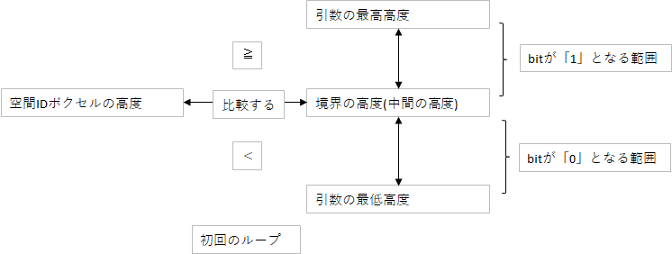
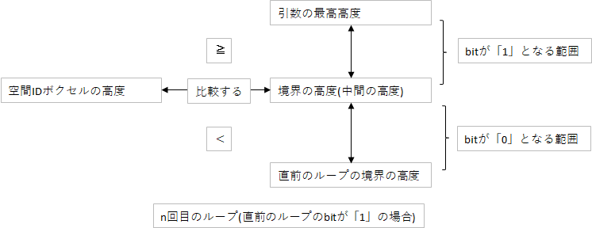
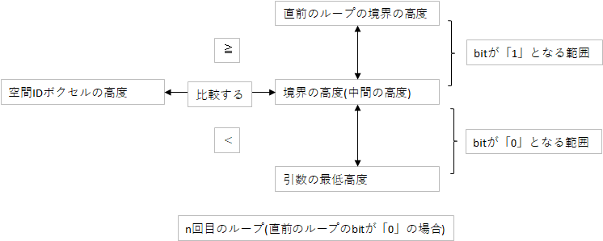
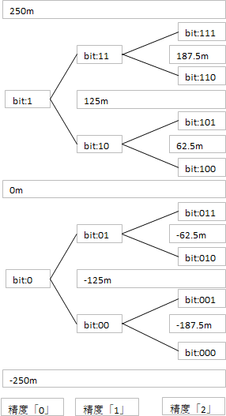
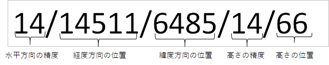
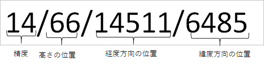
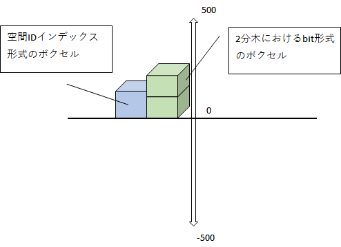
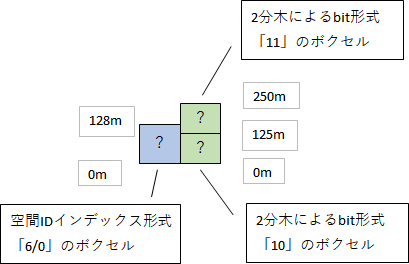
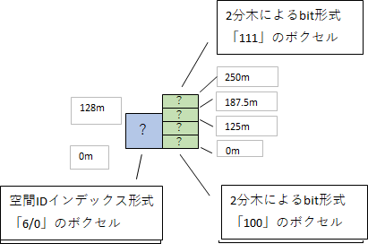

# 内部形式ID⇔拡張空間ID変換
 - 内部形式IDを拡張空間IDに変換する。
 - 拡張空間IDを内部形式IDに変換する。
 - 内部形式IDを空間IDに変換する。
 - 空間IDを内部形式IDに変換する。
 - 高さの方向の変換について。

## 概要
水平方向はQuadkeyに変換可能な数値とXYZタイルインデックス形式の数値で相互変換をする。
垂直方向は拡張空間ID形式の数値と2分木におけるbit形式の数値で相互変換をする。


<div style="page-break-before:always"></div>

## 内部形式IDから拡張空間IDに変換する。
 
## 変更履歴

|  版数  |    日付    | 概要     | 更新者 |
| ------ | ---------- |----------| ------ |
|  0.01  | 2022/10/03 | 新規作成 |  嶋津  |
|  0.02  | 2022/10/12 | 内部レビュー対応 |  嶋津  |
|  0.03  | 2022/10/24 | 外部レビュー対応 |  嶋津  |
|  0.04  | 2022/11/08 | 高さの基準に関する記述の削除 |  嶋津  |
|  0.05  | 2022/11/10 | 戻り値を構造体に修正 |  嶋津  |
|  0.06  | 2022/11/14 | quadkey、bit形式のIDを数値に修正 |  嶋津  |
|  0.07  | 2022/11/16 | IDの入力を構造体に変更<br>出力のIDを文字列に変更 |  嶋津  |
|  0.08  | 2022/11/18 | 空間IDを拡張空間IDに変更 |  嶋津  |
|  0.09  | 2022/11/24 | quadkeyの入力可能精度を1-31に変更 |  嶋津  |
|  0.10  | 2023/01/16 | Quadkeyと高さ方向のIDを内部形式IDに変更 |  嶋津  |


### 処理概要
入力の構造体に格納されたquadkey数値と高さ方向のインデックスを拡張空間ID形式のスライスに変換をする。  
入力の構造体には、quadkey文字列と変換後の水平方向精度、高さ方向のIDと変換後の高さ方向の精度、最高高度、最低高度が入力可能である。  
単一のIDを拡張空間IDに変換する場合は、長さが1となる構造体のスライスを入力する。  
最高高度、最低高度の両方が同じ値の場合、高さ方向のIDを拡張空間ID形式とする。  
最高高度＞最低高度となる値が入力されている場合、高さ方向のIDを2分木におけるbit形式とする。  
最高高度＜最低高度となる値が入力されている場合、エラーとする。
引数で入力する精度は出力の拡張空間IDの精度となる。  
1つの入力に対し、複数の拡張空間ID形式の数値を返却する場合がある。  

### 処理順序
1. 引数の構造体をイテレータとして以降の処理をスライスの長さ分、繰り返す。  
1. quadkeyを変換し、XYZタイルインデックス形式にする。  
  例)quadkeyが「2914」の場合を考える。  

    1. quadkeyを4進数文字列に変換し、先頭から1文字ずつ取り出し、Xインデックス、Yインデックスに変換する。  
       変換した文字列をイテレータとしてループ処理を開始する。  
       1. Xインデックスを1bit、左シフトする。  
       1. Yインデックスを1bit、左シフトする。  
       1. イテレータから取り出した値によって以下のbitの追加をする。  
          - 取り出した値が「"0"」の場合、  
           何もしない。  
          - 取り出した値が「"1"」の場合、  
           Xインデックスの末尾を「1」とする。  
          - 取り出した値が「"2"」の場合、  
           Yインデックスの末尾を「1」とする。  
          - 取り出した値が「"3"」の場合、  
           Xインデックスの末尾を「1」とする。  
           Yインデックスの末尾を「1」とする 。 
       1. 取り出したbitをインデックスの数値とする。  
        取り出した例)
        Xインデックス ：「011000」→ 「24」   
        Yインデックス ：「110101」→ 「53」  
       1. 精度、Xインデックス、Yインデックスを「/」で連結し、⽔平⽅向のIDとする。
        精度は構造体の水平精度とする。
        「精度/Xインデックス/Yインデックス」の形式にする。
        ⽔平⽅向のID：「6/24/53」

    1. 引数の出力の水平精度と水平方向のIDの精度を比較し、ズームインまたは、ズームアウトの処理を実行する。  
      引数の精度＞水平方向のIDの精度の場合、ズームインの処理を実行する。  
      引数の精度＜水平方向のIDの精度の場合、ズームアウトの処理を実行する。  
      引数の精度と水平方向のIDの精度が同じ場合は、何もしない。  
      ※ズームインまたは、ズームアウトの処理は拡張空間IDの精度変換のAPIを呼び出す。  
1. 入力の高さ方向のIDを拡張空間ID形式の文字列に変換する。  
   1. 入力の高さ方向のID形式を判定する。  
    引数の最高高度と最低高度の両方が同じ値の場合、拡張空間ID形式とする。  
    引数の最高高度＞最低高度となる値が入力されている場合、2分木におけるbit形式とする。  
    引数の最高高度＜最低高度となる値が入力されている場合、エラーとする。  
      - 入力の高さ方向のIDが拡張空間ID形式の場合、  
       入力の精度と高さの方向のIDの精度を比較する。  
       引数の精度＞高さの方向のIDの精度の場合、ズームインの処理を実行する。  
       引数の精度＜高さの方向のIDの精度の場合、ズームアウトの処理を実行する。  
       引数の精度と高さの方向のIDの精度が同じ場合は、何もしない。  
       ※ズームインまたは、ズームアウトの処理は拡張空間IDの精度変換のAPIを呼び出す。  
      - 入力の高さ方向のIDが2分木におけるbit形式の場合、入力値を高さのインデックスとし、計算する。  
      例)高さのインデックスに「76」が入力されている場合を考える。  
      1. 高さ方向のIDで表現されるボクセル1個あたりの高さを計算する。  
        (入力の最高高度 - 入力の最低高度) ÷ 2^精度(構造体から取得した垂直精度)  
        例)最高高度 256m、最低高度 -256mの場合、  
        256 - (-256) = 512  
        512 ÷ 2^7 = 4  
        精度7におけるボクセル1個あたりの高さは「4m」となる。  
      1. ボクセルの最高高度の計算を計算する。  
        (ボクセル1個あたりの高さ × (インデックス + 1)) + 最低高度  
        4 × (76 + 1) + -256 = 308 -256 = 52  
      1. ボクセルの最低高度の計算を計算する。  
        (ボクセル1個あたりの高さ × インデックス) + 最低高度  
        4 × 76 + -256 = 304 -256 = 48  
      1. ボクセルの最高高度と最低高度と入力の精度から高さの方向のインデックスを取得する。  
        例)入力の精度 26、ボクセルの最高高度 52m、ボクセルの最低高度 48m の場合、  
        「52」、「48」 が得られる。  
        ※高さの方向のIDの計算は座標を拡張空間IDに変換するAPIを呼び出し、精度とインデックスを取得する。  
      1. 最高高度の高さのインデックスと最低高度の高さのインデックスに差が存在する場合、その間の高さのインデックスを取得する。  
        例）最高高度のインデックスが「52」、最低高度のインデックスが「48」の場合、  
        「52」、「51」、「50」、「49」、「48」のインデックスを数値として取得する。  
    
1. 水平方向のIDと高さの方向のIDを「"/"」で結合し、返却用のスライスに追加する。  
  返却される拡張空間IDのスライス例)
```
  「6/24/53/26/52」、「6/24/53/26/51」、「6/24/53/26/50」、「6/24/53/26/49」、
「6/24/53/26/48」(スライスの要素は順不同)
```

<div style="page-break-before:always"></div>

## 拡張空間IDから内部形式IDに変換する。

## 変更履歴

|  版数  |    日付    | 概要     | 更新者 |
| ------ | ---------- |----------| ------ |
|  0.01  | 2022/10/03 | 新規作成 |  嶋津  |
|  0.02  | 2022/10/12 | 内部レビュー対応 |  嶋津  |
|  0.03  | 2022/10/24 | 外部レビュー対応 |  嶋津  |
|  0.04  | 2022/11/08 | 高さの基準に関する記述の削除 |  嶋津  |
|  0.05  | 2022/11/10 | 戻り値を構造体に修正 |  嶋津  |
|  0.06  | 2022/11/14 | quadkey、bit形式のIDを数値に修正 |  嶋津  |
|  0.07  | 2022/11/16 | 空間IDを文字列のスライスに修正 |  嶋津  |
|  0.08  | 2022/11/18 | 空間IDを拡張空間IDに変更 |  嶋津  |
|  0.09  | 2023/01/16 | Quadkeyと高さ方向のIDを内部形式IDに変更<br>戻り値の構造体のquadkeyと高さ方向のインデックスを内部形式IDの組み合わせに変更 |  嶋津  |

### 処理概要
 入力の拡張空間IDを内部形式IDに変換をする。  
 高さ方向のIDは2分木におけるbit形式、拡張空間ID形式がある。  
 最高高度、最低高度の両方が同じ値の場合、高さ方向のIDは拡張空間ID形式とする。  
 最高高度＞最低高度となる値が入力されている場合、2分木におけるbit形式とする。  
 最高高度＜最低高度となる値が入力されている場合、エラーとする。  
 引数で入力する精度は出力する内部形式IDの精度となる。  
 1つの拡張空間IDから複数の内部形式IDを返却する場合がある。  
 quadkeyは文字列ではなく、quadkeyに変換可能な数値として返却する。

### 処理順序
1. 引数の拡張空間IDのスライスをイテレータとして以降の処理をスライスの長さ分、繰り返す。  
1. 水平方向のIDと高さ方向のIDを作成する。  
   構造体から取得した拡張空間IDを精度とインデックスに分割する。  
   拡張空間IDの形式は以下。  
   「水平方向精度/Xインデックス(経度インデックス)/Yインデックス(緯度インデックス)/高さの方向の精度/高さの方向のインデックス」  
  1. 水平方向のIDをquadkey文字列に変換可能な数値に変換する。  
     1. 引数の精度と水平方向のIDの精度を比較し、ズームインまたは、ズームアウトの処理を実行する。  
      引数の精度＞水平方向のIDの精度の場合、ズームインの処理を実行する。  
      引数の精度＜水平方向のIDの精度の場合、ズームアウトの処理を実行する。  
      引数の精度と水平方向のIDの精度が同じ場合は、何もしない。  
      ※ズームインまたは、ズームアウトの処理は拡張空間IDの精度変換のAPIを呼び出す。  
      ※精度変換後に複数の水平方向のIDが存在する場合は、変換したすべてのIDをquadkeyに変換可能な数値に変換する。  
     1. XインデックスとYインデックスをquadkeyに変換可能な数値にする。
      - 変換方法  
        1. 精度分、以下の処理を繰り返す。
        1. Xインデックス ÷ 2 の余りを(ループ回数 × 2)分左シフトし加算する。  
        1. Xインデックス ÷ 2 の商が0よりも大きい場合、ループを継続する。ループが終了した場合、Yインデックスの処理を開始する。  
        1. Yインデックス ÷ 2 の余りを2倍した値を(ループ回数 × 2)分左シフトし加算する。  
        1. Yインデックス ÷ 2 の商が0よりも大きい場合、ループを継続する。　　
        1. XインデックスとYインデックスのループ処理で得られた数値を加算する

       例)Xインデックス「24」、Yインデックス「53」を変換した場合は、「2914」が得られる。
       ※「2914」を4進数で表現すると「231202」となり、quadkey文字列と一致する。  
       得られた数値を構造体に追加をする。
  1. 高さの方向のIDを指定の形式にID変換する。  
     1. 出力の高さ方向のID形式を判定する。  
     引数の最高高度と最低高度の両方が同じ値の場合、拡張空間ID形式とする。  
     引数の最高高度＞最低高度となる値が入力されている場合、2分木におけるbit形式とする。  
     引数の最高高度＜最低高度となる値が入力されている場合、エラーとする。  
        - 高さの方向のIDを2分木におけるbit形式に変換する場合、  
          1. 拡張空間IDから拡張空間IDボクセルの最高高度と最低高度、経度、緯度を取得する。  
          ※拡張空間IDの頂点座標を取得するAPIを呼び出す。  
          1. 以下の計算を精度の回数分繰り返し、高さ方向のIDとする。  
              1. bitの境界となる判定位置の計算をする。  
               (引数の最高高度 - 引数の最低高度) ÷ 2  
              1. 判定位置と高さを比較する。  
               高さ≧判定位置 の場合は、取得するbitを「1」とする。  
               判定位置＜高さ の場合は、取得するbitを「0」とする。  
               

              1. 取得したbitが「1」の場合、  
               (最高高度(前の周のループの判定位置) - 判定位置) ÷ 2 の値を新しい判定位置とする。  
               
              1. 取得したbitが「0」の場合、  
               (判定位置 - 最低高度(前の周のループの判定位置)) ÷ 2 の値を新しい判定位置とする。  
               

              1. 入力の精度の回数分「2.〜4.」の処理を繰り返す。  
               取得した順にbitを並べ数値として返却する。  
               例として最高高度「250m」、最低高度「-250m」とした場合の各bitは下記のように取得される。

               取得したbitは数値として扱う。
              1. 「ボクセルの最高高度」と「ボクセルの最低高度」間のインデックスを補完する。  
               例)取得した数値が「75」と「72]」の場合、  
                「75」,「72」,「73」,「74」が取得される。  
                最高高度と最低高度のbitが同じ場合は、この処理は実行しない。  
        - 高さの方向のIDを拡張空間ID形式に変換する場合、  
             引数の精度と高さの方向のIDの精度を比較し、ズームインまたは、ズームアウトの処理を実行する。  
             引数の精度＞高さの方向のIDの精度の場合、ズームインの処理を実行する。  
             引数の精度＜高さの方向のIDの精度の場合、ズームアウトの処理を実行する。  
             引数の精度と高さの方向のIDの精度が同じ場合は、何もしない。  
             ※ズームインまたは、ズームアウトの処理は拡張空間IDの精度変換のAPIを呼び出す。  
             ※拡張空間IDの精度変換のAPIを呼び出す。  

1. 水平方向のIDと高さの方向のIDのスライスを返却用の構造体に追加する。  
  返却される構造体例)
  
  - 2分木におけるbit形式の場合
```
    struct{
      quadkeyZoom: 6
      innerIDList: [[2914,75],[2914,74],[2914,73],[2914,72]]
      vZoom: 7
      maxHeight: 250
      minHeight: -250
    }(スライスの要素は順不同)
```
  - 拡張空間ID形式の場合
```
    struct{
      quadkeyZoom: 6
      innerIDList: [[2914,52],[2914,51],[2914,50],[2914,49],[2914,48]]
      vZoom: 26
      maxHeight: 0
      minHeight: 0
    }(スライスの要素は順不同)
```
<div style="page-break-before:always"></div>

## 内部形式IDを空間IDに変換する。

## 変更履歴

|  版数  |    日付    | 概要     | 更新者 |
| ------ | ---------- |----------| ------ |
|  0.01  | 2022/11/18 | 新規作成 |  嶋津  |
|  0.02  | 2023/01/16 | Quadkeyと高さ方向のIDを内部形式IDに変更 |  嶋津  |

### 処理概要
入力の構造体に格納されたquadkeyと高さ方向のインデックスを空間ID形式のスライスに変換をする。  
入力の構造体には、quadkeyの数値、quadkeyの精度、高さ方向のIDと最高高度、最低高度、変換後の精度が入力可能である。  
単一のIDを空間IDに変換する場合は、長さが1となる構造体のスライスを入力する。  
最高高度、最低高度の両方が同じ値の場合、高さ方向のIDを空間ID形式とする。  
最高高度＞最低高度となる値が入力されている場合、高さ方向のIDを2分木におけるbit形式とする。  
最高高度＜最低高度となる値が入力されている場合、エラーとする。
引数で入力する精度は出力の空間IDの精度となる。  
1つの入力に対し、複数の空間ID形式の数値を返却する場合がある。  

### 処理順序
1. 「内部形式IDを拡張空間IDに変換する。」APIを呼び出し拡張空間IDを取得する。
 - 拡張空間ID

1. 取得した拡張空間IDを空間IDに変換する。
 「水平精度/経度の位置/緯度の位置/垂直精度/高さの位置」を変換し「精度/高さの位置/経度の位置/緯度の位置」とする。
 - 変換後の空間ID


 <div style="page-break-before:always"></div>

## 空間IDを内部形式IDに変換する。

## 変更履歴

|  版数  |    日付    | 概要     | 更新者 |
| ------ | ---------- |----------| ------ |
|  0.01  | 2022/11/18 | 新規作成 |  嶋津  |
|  0.02  | 2023/01/16 | Quadkeyと高さ方向のIDを内部形式IDに変更 |  嶋津  |

### 処理概要

### 処理順序
1. 空間IDを拡張空間IDに変換する。
 「精度/高さの位置/経度の位置/緯度の位置」を変換し「水平精度/経度の位置/緯度の位置/垂直精度/高さの位置」とする。
 空間IDの「精度」の値を拡張空間IDの「水平精度」と「垂直精度」とする。
 - 空間ID


 - 変換後の拡張空間ID


1. 「拡張空間IDを内部形式IDに変換する。」APIを呼び出し内部形式IDを取得する。

<div style="page-break-before:always"></div>

## 高さの方向の変換について
 
## 変更履歴

|  版数  |    日付    | 概要     | 更新者 |
| ------ | ---------- |----------| ------ |
|  0.01  | 2022/10/24 | 新規作成 |  嶋津  |
|  0.02  | 2022/11/08 | 高さの基準に関する記述の削除 |  嶋津  |
|  0.03  | 2022/11/14 | bit形式のIDを数値に修正 |  嶋津  |
|  0.04  | 2023/01/16 | Quadkeyと高さ方向のIDを内部形式IDに変更 |  嶋津  |

## 概要
水平面は同精度の場合、quadkeyとXYZタイル形式のボクセルの縦幅と横幅は同一となる。
垂直面は、精度とID形式よって1ボクセルあたりの高さが異なる。


## 考え方

緯度、経度、高さで表現されるボクセルは以下のように空間上で、それぞれ配置されている。



水平面はの精度あたりのサイズ比は共通しているため、垂直方向にのみ注目をする。

例)拡張空間ID精度「6」から2分木におけるbit化形式の精度「2」への変換の場合を考える。
拡張空間ID形式では精度「6」、インデックス「0」のボクセルの最高高度は128m、最低高度は0mとなる。
128mを2分木におけるbit形式の精度2で計算すると最高高度250m、最低高度125mのボクセルが該当する。
0mを2分木におけるbit形式の精度2で計算すると最高高度125m、最低高度0mのボクセルが該当する。



拡張空間ID精度「6」から2分木におけるbit化形式の精度「2」へ変換した場合、拡張空間ID(高さ方向)「6/0」から2分木におけるbit形式のID「11」、「10」が取得される。




同様に拡張空間ID精度「6」から2分木におけるbit化形式の精度「3」へ変換した場合、拡張空間ID(高さ方向)「6/0」から2分木におけるbitとして「110」「101」、「100」が取得される。取得したbitを数値として返却する。

※拡張空間ID形式のボクセルと2分木におけるbit形式のボクセルの精度差によっては重なりが逆転することもある。
