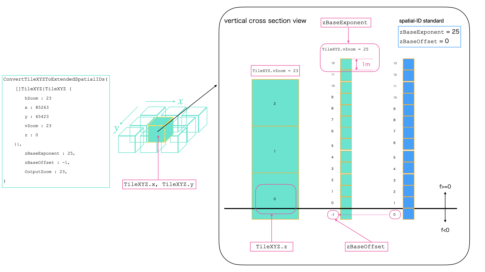

# 空間ID変換関数

`transform/convert_quadkey_and_Vertical_id.go`内にある各種変換関数の利用方法を記載

## 変換関数一覧

| 変換元         | 変換先         | 対応関数                                                   | 今後の変更予定など備考                                            |
|-------------|-------------|--------------------------------------------------------|--------------------------------------------------------|
| 空間ID        | 拡張空間ID      | なし                                                     | `ConvertSpatialIDsToQuadkeysAndVerticalIDs`が部分的に行う     |
| 拡張空間ID      | 空間ID        | `ConvertExtendedSpatialIDToSpatialIDs`                 | `ConvertQuadkeysAndVerticalIDsToSpatialIDs`も部分的に行う     |
| 拡張空間ID      | TileXYZ     | なし                                                     | `ConvertExtendedSpatialIDsToTileXYZ()`に実装予定            |
| TileXYZ     | 拡張空間ID      | `ConvertTileXYZToExtendedSpatialIDs()`                 | 空間IDへの変換は`ConvertExtendedSpatialIDToSpatialIDs`と組み合わせる |
| TileXYZ     | 空間ID        | `ConvertTileXYZToSpatialIDs()`                         | TileXYZ->拡張空間ID変換と拡張空間ID->空間ID変換の組み合わせ                 |
| 3Dtilekey   | 拡張空間ID      | なし                                                     | Pull Request#27のもの 実装**しない**                           |
| 拡張空間ID      | 3Dtilekey   | `ConvertExtendedSpatialIDsToQuadkeysAndAltitudekeys()` | 廃止予定                                                   |
| 一次元インデックス   | 一次元変換インデックス | `ConvertZToAltitudekey()`                              | `TransformIndexCoordinate()`にリネーム予定                    |
| 一次元変換インデックス | 一次元インデックス   | `ConvertAltitudeKeyToZ()`                              | `InverseTransformIndexCoordinate()`にリネーム予定             |
| Key         | 拡張空間ID      | `ConvertQuadkeysAndVerticalIDsToExtendedSpatialIDs()`  | 廃止予定                                                   |
| Key         | 空間ID        | `ConvertQuadkeysAndVerticalIDsToSpatialIDs()`          | 廃止予定                                                   |
| 空間ID        | Key         | `ConvertSpatialIDsToQuadkeysAndVerticalIDs()`          | 廃止予定                                                   |
| 拡張空間ID      | Key         | `ConvertExtendedSpatialIDsToQuadkeysAndVerticalIDs()`  | 廃止予定                                                   |

## ConvertTileXYZToExtendedSpatialIDs

TileXYZ空間のボクセルを拡張空間IDに変換する

変換時、`TileXYZ.x`,`TileXYZ.y`は元の値が利用されるのみである  
しかし`TileXYZ.z`は変換によって元の値に近い垂直方向拡張空間インデックスに変換される

これは`TileXYZ.z`と拡張空間ID垂直インデックスの間ではボクセルのインデックス付番や0番の位置の基準を変更されているためである

この基準とデータを`ConvertTileXYZToExtendedSpatialIDs`の入力として扱う

```go
[]TileXYZ{
    {
        hZoom: 20
        x: 85263
        y: 65423
        vZoom: 23
        z: 0
    }
},
zBaseExponent 25,
zBaseOffset 8,
outputVZoom 23
```

ここで構造体フィールドには次のような値を利用する(fig.1)

- `quadkeyZoom` 水平方向ズームレベル
- `innerIDList` 実際の値: QuadKeyと高度キーの組を配列にしたもの
- `altitudekeyZoom` 垂直方向ズームレベル
- `zBaseExponent` 高度キー1つの実際の高さが1mになるズームレベル
- `zBaseOffset` 高度キー0番に対応する空間ID垂直インデックス
    - ここでは高度キー0番のズームレベルを`zBaseExponent`で扱う


<div style="text-align: center">fig1. ConvertTileXYZToExtendedSpatialIDs入力の高度基準</div>

出力は拡張空間ID文字列になる  
上記の入力は以下の文字列配列として出力される

```
["20/85263/65423/23/-2"]
```

上記の例では入力と出力は1:1であるが、この変換では1:Nに変換されることがある

その条件は次のどちらか

1. `altitudekeyZoom`が`zBaseExponent`または25(これは空間IDの高度基準における`zBaseExponent`である)より大きい場合
2. `zBaseOffset`が2のべき乗でない場合

また、変換の前後でAltitudeKeyにそのズームレベルで存在しないインデックスが現れた場合エラーとなる  
この際変換は失敗となり、変換後のデータはnilとなる

### 変換例

#### 1. 入力TileXYZのzが出力拡張空間ID垂直インデックスに対応する場合

入力

```
[]TileXYZ{
    {
        hZoom : 20
        x: 85263
        y: 65423
        vZoom: 23
        z: 0
    }
},
zBaseExponent: 25,
zBaseOffset: 8,
outputVZoom: 23
```

出力

```
extendedSpatialIDs :["20/85263/65423/23/-2"]
```

#### 2. vZoomが25より大きい場合

入力

```
[]TileXYZ{
    {
        hZoom : 20
        x: 85263
        y: 65423
        vZoom: 26
        z: 3
    }
},
zBaseExponent: 25,
zBaseOffset: -2,
outputVZoom: 26

```

出力

```
extendedSpatialIDs: ["20/85263/65423/26/7", "20/85263/65423/26/7]
```

#### 3. zBaseOffsetが2のべき乗でない場合

入力

```
[]TileXYZ{
    {
        hZoom : 20
        x: 85263
        y: 65423
        vZoom: 23
        z: 0
    }
},
zBaseExponent: 25,
zBaseOffset: 7,
outputVZoom: 23
```

出力

```
extendedSpatialIDs: ["20/85263/65423/23/-2", "20/85263/65423/23/-1"]
```

