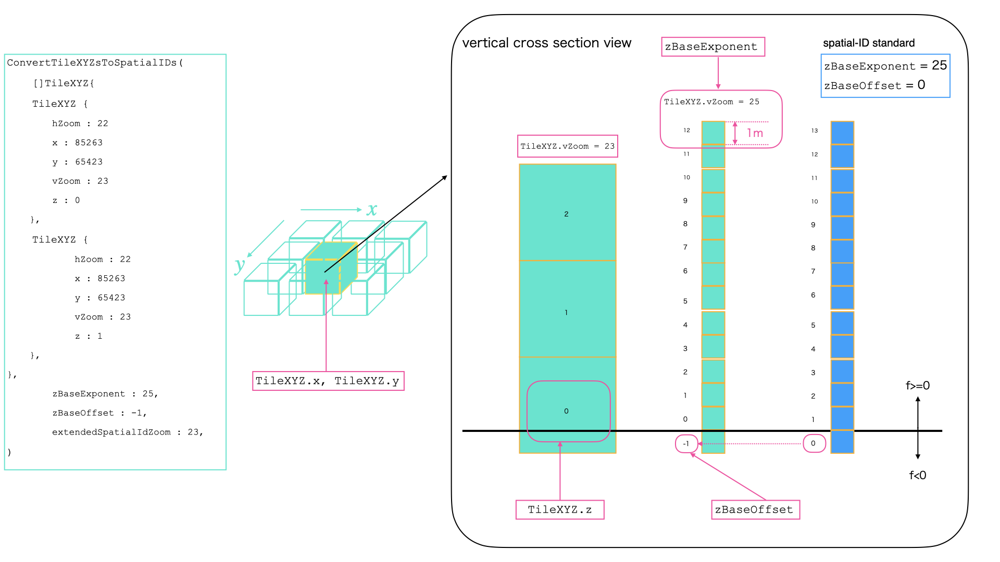
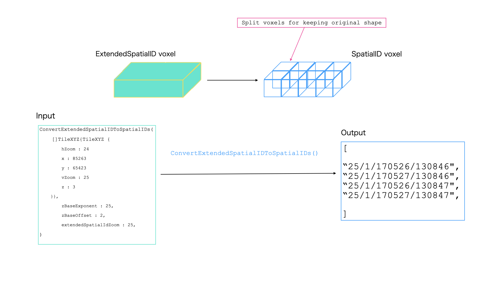

# 空間ID変換関数

`transform/convert_quadkey_and_Vertical_id.go`内にある各種変換関数の利用方法を記載

## 変換関数一覧

| 変換元         | 変換先         | 対応関数                                                   | 今後の変更予定など備考                                            |
|-------------|-------------|--------------------------------------------------------|--------------------------------------------------------|
| 空間ID        | 拡張空間ID      | なし                                                     | `ConvertSpatialIDsToQuadkeysAndVerticalIDs`が部分的に行う     |
| 拡張空間ID      | 空間ID        | `ConvertExtendedSpatialIDToSpatialIDs`                 | `ConvertQuadkeysAndVerticalIDsToSpatialIDs`も部分的に行う     |
| 拡張空間ID      | TileXYZ     | なし                                                     | `ConvertExtendedSpatialIDsToTileXYZ()`に実装予定            |
| TileXYZ     | 拡張空間ID      | `ConvertTileXYZsToExtendedSpatialIDs()`                | 空間IDへの変換は`ConvertExtendedSpatialIDToSpatialIDs`と組み合わせる |
| TileXYZ     | 空間ID        | `ConvertTileXYZsToSpatialIDs()`                        | TileXYZ->拡張空間ID変換と拡張空間ID->空間ID変換の組み合わせ                 |
| 3Dtilekey   | 拡張空間ID      | なし                                                     | Pull Request#27のもの 実装**しない**                           |
| 拡張空間ID      | 3Dtilekey   | `ConvertExtendedSpatialIDsToQuadkeysAndAltitudekeys()` | 廃止予定                                                   |
| 一次元インデックス   | 一次元変換インデックス | `ConvertZToAltitudekey()`                              | `TransformIndexCoordinate()`にリネーム予定                    |
| 一次元変換インデックス | 一次元インデックス   | `ConvertAltitudeKeyToZ()`                              | `InverseTransformIndexCoordinate()`にリネーム予定             |
| Key         | 拡張空間ID      | `ConvertQuadkeysAndVerticalIDsToExtendedSpatialIDs()`  | 廃止予定                                                   |
| Key         | 空間ID        | `ConvertQuadkeysAndVerticalIDsToSpatialIDs()`          | 廃止予定                                                   |
| 空間ID        | Key         | `ConvertSpatialIDsToQuadkeysAndVerticalIDs()`          | 廃止予定                                                   |
| 拡張空間ID      | Key         | `ConvertExtendedSpatialIDsToQuadkeysAndVerticalIDs()`  | 廃止予定                                                   |

## TileXYZ -> 空間ID変換

3Dタイルキー空間でボクセルデータを扱っている場合、`transform`パッケージの関数を用いて(拡張)空間IDへ変換することが可能

以下のコードブロックの全文は[examples/convertTileXYZToSpatialId](../examples/convertTileXYZToSpatialId/main.go)で実行可能

次のような3Dタイルキー空間データがある時を考える

```go
inputData := []struct {
    hZoom uint16
    x     int64
    y     int64
    vZoom uint16
    z     int64
}{
    {
        22,
        85263,
        65423,
        23,
        0,
    },
    {
        22,
        85263,
        65423,
        23,
        1,
    },
}
```

この3Dタイルキー空間データを本ライブラリでパースする方法はいくつかあるが、ここでは`object.TileXYZ`として扱うため以下を実行する

```go
var inputXYZ []*object.TileXYZ
for _, in := range inputData {
    tile, err := object.NewTileXYZ(in.hZoom, in.x, in.y, in.vZoom, in.z)
    if err != nil {
        panic(err)
    }
    inputXYZ = append(inputXYZ, tile)
}
```

作成したTileXYZデータを空間IDへ変換するには、`ConvertTileXYZsToSpatialIDs`を用いる

```go
outputData, err := transform.ConvertTileXYZsToSpatialIDs(
    inputXYZ,
    25,
    -1,
    23,
)
if err != nil {
    panic(err)
}
```

この関数の引数は、以下の並びである
```
request []*object.TileXYZ, zBaseExponent uint16, zBaseOffset int64, extendedSpatialIdVZoom uint16
```

- `request`には先ほど作成したTileXYZデータを渡す
- `zBaseExponent`と`zBaseOffset`は、内部で利用する3Dタイルキー->拡張空間ID変換([`#ConvertTileXYZsToExtendedSpatialIDs`](#converttilexyzstoextendedspatialids))のために3Dタイルキー空間系と空間ID系にある高度インデックスの基準情報を渡す
    - `zBaseExponent`は基準となるズームレベルを指定する: 具体的には、ボクセルのサイズが1mとなる際のズームレベル
    - `zBaseOffset`は、基準となるインデックス番号を指定する: 空間ID系で0番に位置する3Dタイルキー空間系インデックス番号
        - この際のズームレベルは`zBaseExponent`を用いるものとする
- `extendedSpatialIdVZoom`は、内部で利用する拡張空間ID変換([`#ConvertTileXYZsToExtendedSpatialIDs`](#converttilexyzstoextendedspatialids))時に出力するズームレベルを指定する

例で示している`zBaseExponent=25`,`zBaseOffset=-1`は、下図のような関係である  


<div style="text-align: center">fig1. ConvertTileXYZsToSpatialIDs入力の高度基準</div>

変換関数の結果としては、空間IDの文字列配列が得られる

```
{
    "23/0/170526/130846",
    "23/0/170527/130846",
    "23/0/170526/130847",
    "23/0/170527/130847",
    "23/1/170526/130846",
    "23/1/170526/130847",
    "23/1/170527/130846",
    "23/1/170527/130847",
    "23/2/170526/130846",
    "23/2/170526/130847",
    "23/2/170527/130846",
    "23/2/170527/130847",
}
```

この配列が元となった3Dタイルキー空間データ数(2個)に対して12個に増えている理由は大きく分けて2つある:

1. 内部の拡張空間ID変換において、高度基準の指定によりボクセル数が増加している
    - 詳細は[`#ConvertTileXYZsToExtendedSpatialIDs`](#converttilexyzstoextendedspatialids)を確認
    - 例では`zBaseOffset`が2のべき乗ではない(`-1`)ため3個に増加
2. 内部の拡張空間ID->空間ID変換において、垂直ズームレベルと水平ズームレベルを統合するためにボクセル分割を行っている
    - 詳細は[`#ConvertExtenededSpatialIDToExtendedSpatialIDs`](#convertextendedspatialidtospatialids)を確認
    - 例では`TileXYZ.hZoom`より`extendedSpatialIdVZoom`の方が1大きいため、1.で増加した3つに対し4倍されて12個に増加

1.で増加したボクセル数は2.の増加量に影響(乗算で増加)する  
メモリ利用量の観点から増加量を抑えたい場合、次のような条件を設定する:

- `zBaseExponent`を25以下にする
- `zBaseOffset`は2のべき乗にする
- 入力データの水平ズームレベルと同じまたはそれに近い`extendedSpatialIdVZoom`を設定する

### ConvertTileXYZsToExtendedSpatialIDs

TileXYZ空間のボクセルを拡張空間IDに変換する

変換時、`TileXYZ.x`,`TileXYZ.y`は元の値が利用されるのみである  
しかし`TileXYZ.z`は一次元変換(`ConvertAltitudeKeyToZ()`)によって元の値に近い垂直方向拡張空間インデックスに変換される

これは`TileXYZ.z`と拡張空間ID垂直インデックスの間ではボクセルのインデックス付番や0番の位置の基準を変更されているためである

この基準とデータを`ConvertTileXYZsToExtendedSpatialIDs`の入力として扱う

```go
[]TileXYZ{
    {
        hZoom: 20
        x: 85263
        y: 65423
        vZoom: 23
        z: 0
    }
},
zBaseExponent 25,
zBaseOffset 8,
outputVZoom 23
```

ここでパラメータには次のような値を利用する(fig.2)

- `[]TileXYZ` 以下のデータを含む`TileXYZ`のスライス
    - `hZoom` 水平方向ズームレベル
    - `x` 水平方向xキー
    - `y` 水平方向yキー
    - `vZoom` 垂直方向ズームレベル
    - `z` 垂直方向zキー
- `zBaseExponent` 高度キー1つの実際の高さが1mになるズームレベル
- `zBaseOffset` 空間ID垂直インデックス0番に対応する高度キー
    - ここでは高度キー0番のズームレベルを`zBaseExponent`で扱う
- `outputVZoom`出力拡張空間IDの垂直ズームレベル


<div style="text-align: center">fig2. ConvertTileXYZsToExtendedSpatialIDs入力の高度基準</div>

出力は拡張空間ID文字列になる  
上記の入力は以下の文字列配列として出力される

```
["20/85263/65423/23/-2"]
```

上記の例では入力と出力は1:1であるが、この変換では1:Nに変換されることがある

その条件は次のどちらか

1. `vZoom`が`zBaseExponent`または25(これは空間IDの高度基準における`zBaseExponent`である)より大きい場合
2. `zBaseOffset`が2のべき乗でない場合

また、変換の前後で`TileXYZ.z`にそのズームレベルで存在しないインデックスが現れた場合エラーとなる  
この際変換は失敗となり、変換後のデータはnilとなる

#### 変換例

##### 1. 入力TileXYZのzが出力拡張空間ID垂直インデックスに対応する場合

入力

```
[]TileXYZ{
    {
        hZoom : 20
        x: 85263
        y: 65423
        vZoom: 23
        z: 0
    }
},
zBaseExponent: 25,
zBaseOffset: 8,
outputVZoom: 23
```

出力

```
extendedSpatialIDs :["20/85263/65423/23/-2"]
```

##### 2. vZoomが25より大きい場合

入力

```
[]TileXYZ{
    {
        hZoom : 20
        x: 85263
        y: 65423
        vZoom: 26
        z: 3
    }
},
zBaseExponent: 25,
zBaseOffset: -2,
outputVZoom: 26

```

出力

```
extendedSpatialIDs: ["20/85263/65423/26/7", "20/85263/65423/26/7]
```

##### 3. zBaseOffsetが2のべき乗でない場合

入力

```
[]TileXYZ{
    {
        hZoom : 20
        x: 85263
        y: 65423
        vZoom: 23
        z: 0
    }
},
zBaseExponent: 25,
zBaseOffset: 7,
outputVZoom: 23
```

出力

```
extendedSpatialIDs: ["20/85263/65423/23/-2", "20/85263/65423/23/-1"]
```

### ConvertExtendedSpatialIDToSpatialIDs

1つの拡張空間IDの構造体を渡すとその拡張空間IDのボクセル形状を維持した空間ID列へ変換する  
この結果の文字列配列を出力として得ることができる

出力空間ID配列の長さは拡張空間IDの水平ズームレベルと垂直ズームレベルの差に依存する

このズームレベル差を`zDiff`とすると出力空間ID数`outputSize`は次のようになる

1. 水平ズームレベルより垂直ズームレベルの方が大きい場合

`outputSize`は`zDiff`の4のべき乗

```py
outputSize = 4 ** abs(zDiff)
```

2. 垂直ズームレベルより水平ズームレベルの方が大きい場合

`outputSize`は`zDiff`の2のべき乗

```py
outputSize = 2 ** abs(zDiff)
```

これは下図で示すように、入力拡張空間IDの形状を維持するためにボクセル分割を行なっているためである


<div style="text-align: center">fig3. ConvertExtendedSpatialIDToSpatialIDs実行時のボクセル分割</div>

`zDiff=0`の際、ボクセル分割は発生せず出力空間ID数は1つになる  
そのため、メモリ使用量の観点からはなるべく水平ズームレベルと垂直ズームレベルの差が少ない(=`zDiff`が0に近い)拡張空間IDを用いることを推奨する

#### 使用例

##### 1. 水平ズームレベルの方が低い場合

入力

```
ExtendedSpatialID{
	hZoom: 6,
	x:     24,
	y:     49,
	vZoom: 7,
	z:     0,
}
```

出力

```
[]string{"7/0/48/98", "7/0/48/99", "7/0/49/98", "7/0/49/99"}
```

##### 2. 垂直ズームレベルの方が低い場合

入力

```
ExtendedSpatialID{
	hZoom: 7,
	x:     24,
	y:     53,
	vZoom: 6,
	z:     24,
}
```

出力

```
[]string{"7/48/24/53", "7/49/24/53"}
```

##### 3. 水平ズームレベル、垂直ズームレベルに差がない場合

入力

```
ExtendedSpatialID{
	hZoom: 6,
	x:     24,
	y:     49,
	vZoom: 6,
	z:     0,
}
```

出力

```
[]string{"6/0/24/49"}
```
